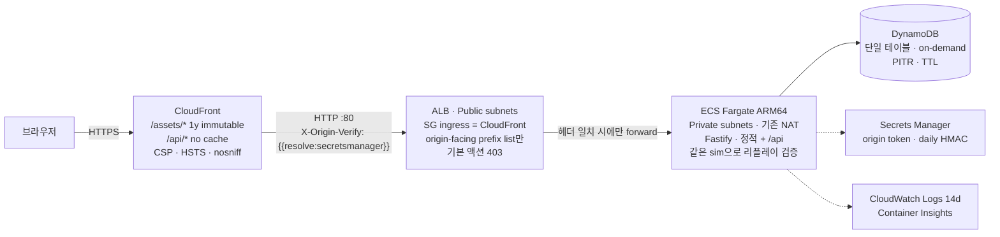

<div align="center">

# CLAWD JUMP: ECHO TOWER

### 메아리의 탑

**절차적 벡터 아트로 그린 정밀 플랫포머 — 그리고 서버가 재생해 검증하는 기록**

[](https://clawd-game.whchoi.net/)

[](#결정론적-시뮬레이션이-백엔드를-정당화한다)
[](#테스트)
[](#숫자로-보기)
[](#pwa-설치와-오프라인)
[](#아키텍처)
[](LICENSE)

</div>

---

## 무엇인가

[CLAWD JUMP — Azure Ascent](docs/superpowers/specs/2026-09-06-clawd-echo-tower-design.md)의 후속작입니다. 달리고, 더블 점프하고, 8방향 대시로 끊고, 4칸 폭 수직 통로를 월점프로 오릅니다. 여기에 세 가지가 더해졌습니다.

- **대시 크리스탈** `D` — 공중에서 대시와 점프를 되찾는다. 크리스탈 체인이 v층의 핵심 기믹.
- **스위치 블록** `%` `&` 와 **토글** `k` — 대시로 토글을 통과하면 두 블록의 실체가 뒤바뀐다.
- **메아리(Echo)** — 내 최고 기록과 세계 최고 기록이 반투명한 클로드로 나와 함께 달린다. 다운로드하는 것은 영상이 아니라 **틱당 1바이트의 입력 로그**다.

모드는 세 가지입니다. **탑 오르기**(3개 층 × 3구역 = 9구역), **데일리 타워**(서버가 매일 UTC 자정에 발급하는 시드로 모두가 같은 탑을 오르고 세계 순위를 겨룸), **끝없는 등반**(차오르는 조류, 개인 기록).

참조작과 마찬가지로 스프라이트, 타일셋, 오디오 파일은 한 바이트도 내려받지 않습니다. 캐릭터·지형·하늘·효과음·음악 전부 런타임에 생성됩니다. 외부 요청은 UI 웹폰트 하나뿐입니다. UI는 한국어, 코드와 주석은 영어입니다.

## 참조작을 어떻게 넘어섰나

| | CLAWD JUMP (참조) | ECHO TOWER |
|---|---|---|
| 호스팅 | S3 + CloudFront (정적) | CloudFront → prefix-list SG ALB → ECS Fargate (Graviton) → DynamoDB |
| 시뮬레이션 | `world.js` 안에 렌더·오디오·카메라가 결합 | `src/sim` — DOM 의존 0, **브라우저와 서버에서 동일 번들 실행** |
| 기록 | localStorage 개인 기록 | 서버가 리플레이를 **재생해 검증**한 세계 리더보드 |
| 고스트 | 없음 | 내 메아리 / 세계 메아리 (입력 로그 재생, 락스텝) |
| 일일 콘텐츠 | 없음 | HMAC(날짜) 시드 데일리 타워, 30일 TTL 리더보드 |
| 입력 | 이벤트 큐 → 프레임당 엣지 소비 (역사적으로 버그 원인) | **틱당 마스크 1바이트**, 엣지는 sim 내부에서 `mask & ~prev`로 유도 |
| 언어 | JS + Python 레벨 빌더 | TypeScript 단일 툴체인 (클라이언트·sim·서버·인프라·레벨 DSL) |
| 배포 산출물 | 해시 없는 파일, 5분 TTL + 전체 무효화 | 콘텐츠 해시 에셋 1년 immutable, `index.html` no-cache |
| 테스트 | CDK 스택 8개 | sim·레벨·클라이언트·서버·인프라 **384개** + Playwright 스모크 + 배포 후 점검 |

## 아키텍처



**네트워크**는 만들지 않습니다. 기존 `cc-on-bedrock-vpc`(`vpc-0dfa5610180dfa628`)를 `Vpc.fromLookup`으로 가져와 ALB는 Public 서브넷, 태스크는 Private 서브넷(기존 NAT Gateway 2개 경유)에 둡니다. 이 VPC에는 S3·DynamoDB 게이트웨이 엔드포인트와 ECR·Logs·Secrets Manager 인터페이스 엔드포인트가 이미 있어 이미지 풀·로그·시크릿 조회가 VPC 안에서 끝납니다. 스택이 만드는 네트워크 리소스는 보안 그룹 2개뿐입니다.

### CF-Prefix SG 경로 (ALB에 CloudFront만 닿게 하는 세 겹)

1. **보안 그룹** — ALB SG의 인그레스 규칙은 단 하나, `com.amazonaws.global.cloudfront.origin-facing` 관리형 prefix list(`pl-22a6434b`, ap-northeast-2)에서 오는 tcp/80. `0.0.0.0/0` 규칙은 없습니다(CDK 리스너를 `open: false`로 만들어 자동 규칙을 막음).
2. **리스너 기본 액션 403** — prefix list 안의 다른 CloudFront 배포가 이 ALB를 원본으로 삼아도 헤더가 없으면 `Forbidden`.
3. **`X-Origin-Verify` 헤더 규칙** — CloudFront가 원본 요청에 붙이는 커스텀 헤더 값과 리스너 규칙의 조건 값 모두 Secrets Manager의 **동적 참조**(`{{resolve:secretsmanager:…}}`)입니다. 합성된 템플릿에 토큰 평문이 없습니다(테스트로 단언).

### 결정론적 시뮬레이션이 백엔드를 정당화한다

정적 사이트에 서버를 붙이는 것은, 서버가 정적 사이트가 할 수 없는 일을 할 때만 의미가 있습니다. 여기서 그 일은 **검증**입니다.

- `src/sim`은 1/120초 틱마다 입력 마스크 1바이트(`LEFT=1 RIGHT=2 UP=4 DOWN=8 JUMP=16 DASH=32`)를 소비합니다. 그래서 한 판의 리플레이는 `Uint8Array` 하나이고, RLE + base64로 1분 분량이 수백 바이트입니다.
- `Math.sin/cos/exp/pow/hypot/atan2/random`과 `Date`는 sim 안에서 금지됩니다. IEEE-754가 비트 동일성을 보장하는 `+ - * / sqrt floor`와 `src/sim/dmath.ts`의 다항 근사만 씁니다. 난수는 시드된 mulberry32 하나입니다. V8과 JavaScriptCore가 같은 답을 내야 서버 검증이 성립하기 때문입니다.
- 클라이언트가 `POST /api/runs`로 보내는 것은 결과가 아니라 **입력 로그와 주장(claim)**입니다. 서버는 클라이언트가 내려받은 것과 같은 sim 번들로 로그를 재생하고, 틱 수·샤드·사망·클리어 여부가 주장과 다르면 **422**로 거절합니다. 이 aarch64 호스트에서 10분 분량(72,000틱) 검증에 약 290 ms가 걸립니다.
- 검증된 기록의 입력 로그가 곧 **메아리**입니다. 다른 플레이어가 그 로그를 내려받아 두 번째 `Sim`에 먹이면, 별도의 위치 스트림 없이 완전히 같은 궤적이 재현됩니다.

### 서버와 데이터

Fastify 5. `GET /healthz`(ALB 헬스체크), `GET /api/health`, `GET /api/daily`, `POST /api/runs`, `GET /api/leaderboard`, `GET /api/ghost/:runId`. 모든 입출력은 `src/shared/protocol.ts`의 zod 스키마로 파싱됩니다. 어시스트 모드 기록은 보드 부적격, 데일리는 오늘·어제(UTC)만 접수하고 시드는 서버 HMAC과 일치해야 합니다. 검증은 2,400틱마다 이벤트 루프에 양보하고, 주장이 정당화할 수 없는 길이의 로그는 재생 전에 거절합니다. 속도 제한은 IP(`CloudFront-Viewer-Address`, 기록 제출 12회/분) + 플레이어 ID(10회/분) 이중입니다. 리더보드는 플레이어의 유일한 자격 증명인 원본 id를 절대 내보내지 않고 HMAC `playerTag`와 서버가 계산한 `you`만 줍니다.

DynamoDB 단일 테이블(`pk`/`sk`): `LB#<mode>#<board>` / `<score 12자리>#<99999-shards>#<runId>`(오름차순 쿼리 = 가장 빠른 기록부터, 동점은 샤드 많은 순), `RUN#<runId>` / `META`(리플레이 본문), `PLAYER#<id>` / `BEST#<mode>#<board>`(내 순위는 GetItem 한 번). 개인 최고 갱신은 조건식이 붙은 TransactWrite 한 번으로 이전 보드 항목을 지우며 기록하고, 동시 제출 충돌은 재조회 후 재시도합니다. 데일리 항목은 30일 TTL.

## PWA: 설치와 오프라인

게임이 내려받는 것이 `index.html`과 해시된 JS/CSS 한 벌뿐이고 시뮬레이션이 클라이언트에서 완결되므로, PWA로 만들면 **스토리와 끝없는 등반은 완전 오프라인**으로 플레이됩니다.

- `manifest.webmanifest`(전체 화면·가로 고정·192/512/maskable 아이콘)와 iOS용 `apple-touch-icon`/메타. Android Chrome은 타이틀 메뉴의 **홈 화면에 추가** 항목(`beforeinstallprompt`)으로, iOS Safari는 공유 → 홈 화면에 추가 안내로 설치합니다.
- `/sw.js`(해시 없는 고정 URL, `no-cache`)는 빌드가 해시 에셋 목록과 빌드 ID를 주입해 **원자적으로 프리캐시**합니다. `/assets/*`는 cache-first, `index.html`은 network-first(오프라인이면 캐시), `/api/*`와 교차 출처 요청은 절대 가로채지 않습니다(SW 자신의 CSP가 `connect-src 'self'`).
- 새 배포가 감지되면 "새 버전이 준비됐다 · 새로고침" 바가 뜨고(플레이 중에는 숨김), 확인 시 `skip-waiting` → 새로고침 한 번.
- **오프라인 데일리**: 오늘의 시드를 받아둔 적이 있으면 그 시드로 플레이하고, 완료된 기록은 `localStorage` 대기열(최대 20개)에 넣어 온라인 복귀 시 자동 전송합니다. 서버가 어차피 재생·검증하므로 지연 제출도 안전하며, 데일리는 오늘·어제 안에 복귀하면 유효합니다.
- 회전 안내는 짧은 변이 600px 미만인 폰에서만 뜨고 "그래도 계속"으로 닫을 수 있습니다. iPad는 세로로도 플레이됩니다(레터박스).
- 검증: `npm run qa:smoke`의 `offline` 단계(서비스 워커 프리캐시 후 `setOffline(true)` 새로고침), `npm run qa:mobile`(iPhone 14·Galaxy S9+·iPad Pro 11 가로/세로 에뮬레이션: 메뉴가 뷰포트 안에 있는지, 힌트가 가상 버튼과 겹치지 않는지, 태블릿 세로에서 회전 안내가 안 뜨는지).

> iOS는 Chromium 기기 에뮬레이션으로 검증했습니다. Safari 고유 동작(7일 미사용 시 캐시 삭제, 가로 고정 미지원, 수동 설치)은 실기기 확인이 필요합니다. 결정론은 설계상 보장되지만 iOS 실기기에서의 기록 제출은 아직 실측하지 않았습니다.

## 조작

| 동작 | 키보드 | 게임패드 |
|---|---|---|
| 이동 | `←` `→` / `A` `D` | 왼쪽 스틱 · D-pad |
| 점프 / 더블 점프 | `Space` `Z` `J` | A |
| 대시 (8방향) | `Shift` `X` `K` | X · Y · RB · RT |
| 스톰프 | 공중에서 `↓` | 아래 |
| 월점프 | 벽 슬라이드 중 점프 | |
| 일시정지 / 재시작 | `Esc` `P` / `R` | Start / Back |

모든 키는 재설정할 수 있고, 다른 동작이 쓰는 키는 거절됩니다. 터치 기기에서는 가상 스틱과 버튼이 나타나며 키보드·패드·터치가 같은 마스크 층으로 합쳐집니다. 어시스트 모드(약한 중력·3단 점프·짧은 대시 쿨다운), 무적, 플래시 억제, `prefers-reduced-motion` 첫 실행 반영, HUD 라이브 리전(스크린리더)을 지원합니다.

## 레포 구조

```
src/sim/        결정론적 엔진 (DOM 의존 없음) — types · legend · config · level · player · entities · foes · sim · replay · gen/
src/shared/     biomes(아트 디렉션) · protocol(zod)
src/client/     render(stage·sky·tiles·particles·clawd 리그·actors) · audio(합성 sfx·시퀀서) · ui(DOM) · input · net · echo · fx · camera · save · scenes · shot(QA)
src/server/     Fastify app · routes · runs(검증 파이프라인) · daily(HMAC 시드) · repo(memory · dynamo) · static
levels/         TypeScript DSL + 검증기 + 9개 구역 → src/sim/levels.generated.ts
infra/          CDK 스택: Network(import) · Data · Service · Edge
tools/          build.mjs(esbuild) · dev.mjs · qa/smoke.ts(Playwright) · postdeploy.mjs
test/           sim · levels · client · server · infra · tools
docs/superpowers/  설계 스펙 · 구현 계획
```

## 실행

```bash
npm install
npm run dev            # http://127.0.0.1:8099 — esbuild watch + 인메모리 저장소 서버
npm test               # vitest 384개
npm run typecheck      # 루트 + infra
npm run levels         # 레벨 DSL → levels.generated.ts (검증 포함)
npm run build          # dist/public (해시 에셋) + dist/server/index.js
npm run qa:browser && npm run qa:smoke   # Playwright 스모크 + 오프라인 단계 (dev 서버 필요)
npm run qa:mobile      # 폰·태블릿 에뮬레이션 레이아웃 QA
npm run icons          # public/icons/icon.svg → PNG (Playwright; 결과는 커밋)
```

레벨은 손으로 타이핑하지 않습니다. `levels/dsl.ts`의 프리미티브로 조립하고, 검증기가 직사각형 여부·`P`/`G` 존재·모든 `o`/`R`/`G`의 플러드필 도달성(스위치 극성 양쪽)·7칸 초과 구덩이·통로 폭(3–5칸)을 거절합니다. `src/sim/levels.generated.ts`는 **생성 파일**이므로 직접 고치지 마세요.

## 배포

현재 배포: `ClawdEchoTowerStack` (ap-northeast-2), CloudFront `E38DW91AO2DWTB` → https://clawd-game.whchoi.net/ (배포 도메인 https://d24frhamecczl7.cloudfront.net/ 도 유효)

```bash
export CDK_DEFAULT_ACCOUNT=061525506239 CDK_DEFAULT_REGION=ap-northeast-2
npm run deploy               # cdk deploy — ARM64 이미지 빌드·ECR 푸시·스택 생성, cdk-outputs.json 기록
npm run postdeploy:check     # 엣지 경로 점검: 200·캐시 헤더·CSP/HSTS·/api·ALB 직접 접근 차단
npm run postdeploy:smoke     # + 라이브 URL에 Playwright 스모크
npm run destroy              # 전부 삭제 (테이블·로그·시크릿 포함, 데모용 RemovalPolicy)
```

컨텍스트(`cdk.json`): `vpcId`(가져올 VPC), `cloudfrontPrefixListId`(리전별 prefix list, 조회는 `aws ec2 describe-managed-prefix-lists --filters Name=prefix-list-name,Values=com.amazonaws.global.cloudfront.origin-facing`), `desiredCount`, `domainName` + `certificateArn`(커스텀 도메인: us-east-1 ACM 인증서, 여기서는 기존 `*.whchoi.net` 와일드카드 재사용. DNS는 스택 밖에서 CNAME → 배포 도메인으로 관리하므로 Route 53 레코드는 만들지 않음). `cdk.context.json`(VPC 룩업 캐시)은 재현성을 위해 커밋합니다.

**비용(ap-northeast-2, 대략)** — ALB 약 $18/월 + LCU, Fargate ARM64 0.25 vCPU/0.5 GiB × 2 태스크 약 $14/월, CloudFront·DynamoDB on-demand·Secrets Manager·CloudWatch는 데모 트래픽에서 수 달러. VPC/NAT는 기존 것을 쓰므로 추가 비용이 없습니다.

## QA 하네스

헤드리스 브라우저는 `requestAnimationFrame`을 조절하므로 일반 루프를 캡처하면 빈 캔버스가 나옵니다. 쿼리 플래그가 있을 때만 sim을 동기적으로 N틱 돌리고 한 번 그린 뒤 `<html data-shot="…">`에 상태를 JSON으로 새깁니다.

```
?shot=<levelId|title|endless|daily>&frames=240&hold=right&pulse=jump:26,dash:60&alt=30&bot=wall&at=x,y&ui=select|settings|result
```

`tools/qa/smoke.ts`가 타이틀 → 선택 → 플레이를 실제 키 입력으로 통과하고 9개 구역을 이 하네스로 캡처합니다(콘솔 오류 0 조건). 컨테이너 상태에서 12/12 통과를 확인했습니다.

## 테스트

| 영역 | 무엇을 단언하나 |
|---|---|
| `test/sim` | 동일 입력 → 600/3600/7200틱에서 상태 JSON 동일, 점프 정점 2.5–2.9칸, 탭 < 홀드, 대시 40–50유닛, 4칸 통로 월점프 등반, 스톰프 킬, 크리스탈 리필, 스위치 토글, 조류 사망, 리플레이 라운드트립과 위조 거절 |
| `test/levels` | DSL 검증기(봉인된 방·과도한 구덩이 거절), 9구역 통과, 생성 파일 최신 여부 |
| `test/client` | 입력 래치(프레임 내 탭도 정확히 1엣지), 렌더러 Path2D 병합(fill 호출 상한), 오디오 이벤트 매핑 완전성, UI 템플릿(CSP·스크린 id·라이브 리전·PWA 태그), 셸(틱 스케줄러·FxBus·카메라·저장·API·메아리 락스텝·시나리오·제출 대기열), 서비스 워커(프리캐시 원자성·캐시 정리·라우팅·skip-waiting), PWA 등록/설치 프롬프트 |
| `test/server` | 접수/거절 경로, 마스크 길이 예산과 협조적 검증(`/healthz` 응답성), 플레이어당 보드 항목 1개와 조건부 쓰기 충돌 재시도, `playerTag`/`you`(원본 id 미노출), 경쟁 순위와 샤드 타이브레이크, 데일리 시드 안정성, 고스트 404, 429, API 압축, 정적 캐시 헤더, DynamoDB 키·트랜잭션 형태 |
| `test/infra` | prefix-list 전용 인그레스, 기본 403, 헤더 규칙, 동적 참조 2개·평문 0, HTTPS 리다이렉트, CSP(`unsafe-inline` 없음·`object-src 'none'`), HSTS 1년, 404/403 에지 캐시 TTL 0, ARM64, 서킷 브레이커, on-demand + PITR, 로그 보존, 오토스케일, 이미지 컨텍스트 최소화, 설명 문자열 ASCII, **VPC/NAT/엔드포인트 생성 0** |

## 숫자로 보기

| | |
|---|---|
| 테스트 | 539개 |
| 플레이어가 내려받는 것 | JS 304 KB (gz 92 KB) · CSS 39 KB · HTML 14 KB · SW 2 KB · 폰트 외 외부 요청 0 |
| 콘텐츠 | 9구역 · 3바이옴 · 데일리 타워 · 끝없는 등반 · 적 6종 · 오브젝트 11종 |

## 크레딧 · 라이선스

CLAWD JUMP — Azure Ascent(MIT)의 물리 상수, 리그 드로잉, 블룸 파이프라인, Path2D 지형 병합, 오디오 그래프 설계를 참조해 TypeScript로 재작성했습니다. [MIT](LICENSE).
