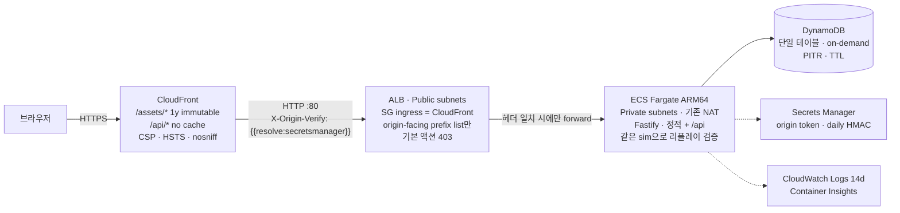

<div align="center">

# CLAWD JUMP: ECHO TOWER

### 메아리의 탑

**절차적 벡터 아트로 그린 정밀 플랫포머 — 그리고 서버가 재생해 검증하는 기록**

[](https://clawd-game.whchoi.net/)

[](#결정론적-시뮬레이션이-백엔드를-정당화한다)
[](#테스트)
[](#숫자로-보기)
[](#pwa-설치와-오프라인)
[](#아키텍처)
[](LICENSE)

</div>

---

## 무엇인가

[CLAWD JUMP — Azure Ascent](docs/superpowers/specs/2026-09-06-clawd-echo-tower-design.md)의 후속작입니다. 달리고, 더블 점프하고, 8방향 대시로 끊고, 4칸 폭 수직 통로를 월점프로 오릅니다. 여기에 세 가지가 더해졌습니다.

- **대시 크리스탈** `D` — 공중에서 대시와 점프를 되찾는다. 크리스탈 체인이 v층의 핵심 기믹.
- **스위치 블록** `%` `&` 와 **토글** `k` — 대시로 토글을 통과하면 두 블록의 실체가 뒤바뀐다.
- **메아리(Echo)** — 내 최고 기록과 세계 최고 기록이 반투명한 클로드로 나와 함께 달린다. 다운로드하는 것은 영상이 아니라 **틱당 1바이트의 입력 로그**다.

모드는 세 가지입니다. **탑 오르기**(3개 층 × 3구역 = 9구역), **데일리 타워**(서버가 매일 UTC 자정에 발급하는 시드로 모두가 같은 탑을 오르고 세계 순위를 겨룸), **끝없는 등반**(차오르는 조류, 개인 기록).

참조작과 마찬가지로 스프라이트, 타일셋, 오디오 파일은 한 바이트도 내려받지 않습니다. 캐릭터·지형·하늘·효과음·음악 전부 런타임에 생성됩니다. 외부 요청은 UI 웹폰트 하나뿐입니다. UI는 한국어, 코드와 주석은 영어입니다.

## 참조작을 어떻게 넘어섰나

| | CLAWD JUMP (참조) | ECHO TOWER |
|---|---|---|
| 호스팅 | S3 + CloudFront (정적) | CloudFront → prefix-list SG ALB → ECS Fargate (Graviton) → DynamoDB |
| 시뮬레이션 | `world.js` 안에 렌더·오디오·카메라가 결합 | `src/sim` — DOM 의존 0, **브라우저와 서버에서 동일 번들 실행** |
| 기록 | localStorage 개인 기록 | 서버가 리플레이를 **재생해 검증**한 세계 리더보드 |
| 고스트 | 없음 | 내 메아리 / 세계 메아리 (입력 로그 재생, 락스텝) |
| 일일 콘텐츠 | 없음 | HMAC(날짜) 시드 데일리 타워, 30일 TTL 리더보드 |
| 입력 | 이벤트 큐 → 프레임당 엣지 소비 (역사적으로 버그 원인) | **틱당 마스크 1바이트**, 엣지는 sim 내부에서 `mask & ~prev`로 유도 |
| 언어 | JS + Python 레벨 빌더 | TypeScript 단일 툴체인 (클라이언트·sim·서버·인프라·레벨 DSL) |
| 배포 산출물 | 해시 없는 파일, 5분 TTL + 전체 무효화 | 콘텐츠 해시 에셋 1년 immutable, `index.html` no-cache |
| 테스트 | CDK 스택 8개 | sim·레벨·클라이언트·서버·인프라 **384개** + Playwright 스모크 + 배포 후 점검 |

## 아키텍처



**네트워크**는 만들지 않습니다. 기존 `cc-on-bedrock-vpc`(`vpc-0dfa5610180dfa628`)를 `Vpc.fromLookup`으로 가져와 ALB는 Public 서브넷, 태스크는 Private 서브넷(기존 NAT Gateway 2개 경유)에 둡니다. 이 VPC에는 S3·DynamoDB 게이트웨이 엔드포인트와 ECR·Logs·Secrets Manager 인터페이스 엔드포인트가 이미 있어 이미지 풀·로그·시크릿 조회가 VPC 안에서 끝납니다. 스택이 만드는 네트워크 리소스는 보안 그룹 2개뿐입니다.

### CF-Prefix SG 경로 (ALB에 CloudFront만 닿게 하는 세 겹)

1. **보안 그룹** — ALB SG의 인그레스 규칙은 단 하나, `com.amazonaws.global.cloudfront.origin-facing` 관리형 prefix list(`pl-22a6434b`, ap-northeast-2)에서 오는 tcp/80. `0.0.0.0/0` 규칙은 없습니다(CDK 리스너를 `open: false`로 만들어 자동 규칙을 막음).
2. **리스너 기본 액션 403** — prefix list 안의 다른 CloudFront 배포가 이 ALB를 원본으로 삼아도 헤더가 없으면 `Forbidden`.
3. **`X-Origin-Verify` 헤더 규칙** — CloudFront가 원본 요청에 붙이는 커스텀 헤더 값과 리스너 규칙의 조건 값 모두 Secrets Manager의 **동적 참조**(`{{resolve:secretsmanager:…}}`)입니다. 합성된 템플릿에 토큰 평문이 없습니다(테스트로 단언).

### 결정론적 시뮬레이션이 백엔드를 정당화한다

정적 사이트에 서버를 붙이는 것은, 서버가 정적 사이트가 할 수 없는 일을 할 때만 의미가 있습니다. 여기서 그 일은 **검증**입니다.

- `src/sim`은 1/120초 틱마다 입력 마스크 1바이트(`LEFT=1 RIGHT=2 UP=4 DOWN=8 JUMP=16 DASH=32`)를 소비합니다. 그래서 한 판의 리플레이는 `Uint8Array` 하나이고, RLE + base64로 1분 분량이 수백 바이트입니다.
- `Math.sin/cos/exp/pow/hypot/atan2/random`과 `Date`는 sim 안에서 금지됩니다. IEEE-754가 비트 동일성을 보장하는 `+ - * / sqrt floor`와 `src/sim/dmath.ts`의 다항 근사만 씁니다. 난수는 시드된 mulberry32 하나입니다. V8과 JavaScriptCore가 같은 답을 내야 서버 검증이 성립하기 때문입니다.
- 클라이언트가 `POST /api/runs`로 보내는 것은 결과가 아니라 **입력 로그와 주장(claim)**입니다. 서버는 클라이언트가 내려받은 것과 같은 sim 번들로 로그를 재생하고, 틱 수·샤드·사망·클리어 여부가 주장과 다르면 **422**로 거절합니다. 이 aarch64 호스트에서 10분 분량(72,000틱) 검증에 약 290 ms가 걸립니다.
- 검증된 기록의 입력 로그가 곧 **메아리**입니다. 다른 플레이어가 그 로그를 내려받아 두 번째 `Sim`에 먹이면, 별도의 위치 스트림 없이 완전히 같은 궤적이 재현됩니다.

### 서버와 데이터

Fastify 5. `GET /healthz`(ALB 헬스체크), `GET /api/health`, `GET /api/daily`, `POST /api/runs`, `GET /api/leaderboard`, `GET /api/ghost/:runId`. 모든 입출력은 `src/shared/protocol.ts`의 zod 스키마로 파싱됩니다. 어시스트 모드 기록은 보드 부적격, 데일리는 오늘·어제(UTC)만 접수하고 시드는 서버 HMAC과 일치해야 합니다. 검증은 2,400틱마다 이벤트 루프에 양보하고, 주장이 정당화할 수 없는 길이의 로그는 재생 전에 거절합니다. 속도 제한은 IP(`CloudFront-Viewer-Address`, 기록 제출 12회/분) + 플레이어 ID(10회/분) 이중입니다. 리더보드는 플레이어의 유일한 자격 증명인 원본 id를 절대 내보내지 않고 HMAC `playerTag`와 서버가 계산한 `you`만 줍니다.

DynamoDB 단일 테이블(`pk`/`sk`): `LB#<mode>#<board>` / `<score 12자리>#<99999-shards>#<runId>`(오름차순 쿼리 = 가장 빠른 기록부터, 동점은 샤드 많은 순), `RUN#<runId>` / `META`(리플레이 본문), `PLAYER#<id>` / `BEST#<mode>#<board>`(내 순위는 GetItem 한 번). 개인 최고 갱신은 조건식이 붙은 TransactWrite 한 번으로 이전 보드 항목을 지우며 기록하고, 동시 제출 충돌은 재조회 후 재시도합니다. 데일리 항목은 30일 TTL.

## PWA: 설치와 오프라인

게임이 내려받는 것이 `index.html`과 해시된 JS/CSS 한 벌뿐이고 시뮬레이션이 클라이언트에서 완결되므로, PWA로 만들면 **스토리와 끝없는 등반은 완전 오프라인**으로 플레이됩니다.

- `manifest.webmanifest`(전체 화면·가로 고정·192/512/maskable 아이콘)와 iOS용 `apple-touch-icon`/메타. Android Chrome은 타이틀 메뉴의 **홈 화면에 추가** 항목(`beforeinstallprompt`)으로, iOS Safari는 공유 → 홈 화면에 추가 안내로 설치합니다.
- `/sw.js`(해시 없는 고정 URL, `no-cache`)는 빌드가 해시 에셋 목록과 빌드 ID를 주입해 **원자적으로 프리캐시**합니다. `/assets/*`는 cache-first, `index.html`은 network-first(오프라인이면 캐시), `/api/*`와 교차 출처 요청은 절대 가로채지 않습니다(SW 자신의 CSP가 `connect-src 'self'`).
- 새 배포가 감지되면 "새 버전이 준비됐다 · 새로고침" 바가 뜨고(플레이 중에는 숨김), 확인 시 `skip-waiting` → 새로고침 한 번.
- **오프라인 데일리**: 오늘의 시드를 받아둔 적이 있으면 그 시드로 플레이하고, 완료된 기록은 `localStorage` 대기열(최대 20개)에 넣어 온라인 복귀 시 자동 전송합니다. 서버가 어차피 재생·검증하므로 지연 제출도 안전하며, 데일리는 오늘·어제 안에 복귀하면 유효합니다.
- 회전 안내는 짧은 변이 600px 미만인 폰에서만 뜨고 "그래도 계속"으로 닫을 수 있습니다. iPad는 세로로도 플레이됩니다(레터박스).
- 검증: `npm run qa:smoke`의 `offline` 단계(서비스 워커 프리캐시 후 `setOffline(true)` 새로고침), `npm run qa:mobile`(iPhone 14·Galaxy S9+·iPad Pro 11 가로/세로 에뮬레이션: 메뉴가 뷰포트 안에 있는지, 힌트가 가상 버튼과 겹치지 않는지, 태블릿 세로에서 회전 안내가 안 뜨는지).

> iOS는 Chromium 기기 에뮬레이션으로 검증했습니다. Safari 고유 동작(7일 미사용 시 캐시 삭제, 가로 고정 미지원, 수동 설치)은 실기기 확인이 필요합니다. 결정론은 설계상 보장되지만 iOS 실기기에서의 기록 제출은 아직 실측하지 않았습니다.

## 로드맵과 Phase 1

`docs/superpowers/plans/2026-09-06-top-chart-roadmap.md`에 3단계 30개 항목의 로드맵이 있습니다(North star: 익명 D1 복귀율 35%). Phase 1은 모든 플레이어가 겪는 실패 루프·온보딩·폴리시입니다.

- **SIM_VERSION 2** — 물리·페이즈 타이밍·지형이 바뀌면 리플레이와 보드가 함께 버전됩니다. 서버는 다른 버전의 제출을 재생 전에 거절(`sim-version`)하고, 스토리 보드 키는 `LB#story#<zone>#s2r<rev>`. 릴리스 절차는 `npm run release:dry`로 계획을 보고 `npm run release -- minor`(typecheck → 테스트 → 빌드 → 배포 → 점검 → CloudFront 무효화 → 에셋 확인 → 버전 태그·CHANGELOG). 롤백은 `docs/runbooks/rollback.md`.
- **무료 실패** — 죽음 → 조작 복귀 약 0.6초(dying 0.45s + 리스폰 인트로 0.15s). `R` 탭은 마지막 체크포인트로 즉시 재도전하며 **입력 로그의 `RETRY` 비트로 기록**되어 서버 재생에서도 재현됩니다. `R`을 0.6초 홀드하면 존 재시작.
- **익명 텔레메트리** — `POST /api/events`: 세션 id(부팅마다 랜덤)와 이벤트만. 플레이어 id·이름·IP는 클라이언트가 보내지 않고 서버 로그도 남기지 않습니다(테스트로 고정). `tools/stats.mjs`가 퍼널·D1 버킷·존별 사망 히트맵을 뽑습니다. 크레딧 옆 '데이터 안내' 화면에 수집/미수집 항목을 밝힙니다.
- **첫 실행 바로 시작** — 새 프로필은 타이틀에서 Enter 한 번에 새벽 물가로 들어가고, 첫 클리어 후 탑 구조와 해금 연출을 봅니다.
- **기기 인식 힌트 + 길잡이 메아리** — 힌트는 `{move} {jump} {dash}` 토큰 템플릿으로 키보드·패드·터치 글리프를 치환하고, 같은 구간에서 반복 사망하면 원인별 힌트를 다시 띄웁니다. 첫 t1에서는 번들된 9초 입력 로그(수백 바이트)를 재생하는 반투명 '길잡이'가 첫 구덩이를 2단 점프로 시연합니다.
- **판독성** — 상승기류 스트릭 파티클, 가시 1.3배·팁 하이라이트(공허의 초는 마젠타 림), 화면 밖 골을 가리키는 비콘, 터치 버튼 반투명·상향 이동. `npm run qa:readability`가 픽셀 대비를 단언합니다.
- **모바일 라이프사이클** — 백그라운드 복귀 시 누적 dt 폐기, 메뉴 30fps, 게임패드 해제 시 일시정지, 숨김 시 오디오 클록 정지.

### Phase 2 (진행 중) — 데일리 스트릭·어제의 탑, 컴백 루프

- **데일리 스트릭·어제의 탑** — 데일리 화면의 '내 기록' 한 칸이 **최근 7일 스트립**(미도전 / 도전 / 클리어, 순위를 알면 숫자)과 **N일 연속** 배지로 바뀌었습니다. 스트릭은 서버 날짜(`DailyResponse.date`) 기준 연속 UTC 일수이며, 탑을 시작한 것만으로 '도전'으로 칩니다(`save.ts streakFor`). `GET /api/daily`가 `yesterday: {date, seed}`를 함께 주고, 부팅 시(하루 1회, 비차단) 어제 보드를 조회해 '어제의 탑 · 세계 N위 / M명'을 보여 주며 날짜가 이틀 이상 지나면 '확정' 배지가 붙습니다. **어제의 탑 재도전**은 어제 시드를 어제 날짜로 제출하고(서버는 오늘·어제만 접수), 타이틀의 '데일리 타워' 소제목은 '오늘 미도전 · 3일 연속' / '오늘 클리어 · 세계 12위'처럼 바뀝니다.
- **게임 오버 컴백 루프** — 조류에 잠긴 뒤 **같은 탑 다시**(같은 시드, 내 최고 등반의 메아리와 함께)와 **새 탑**(끝없는 등반의 새 시드)이 갈라지고, 최고 높이까지의 진행 바('신기록까지 N칸' / '신기록!')와 데일리의 '내 최고 높이 · 세계 최고' 행이 붙습니다. 최고 등반의 리플레이는 `progress.endless.bestMasks/bestSeed/bestSim`에 남습니다.
- **이름 온보딩·막힘 감지** — 첫 유효 기록은 결과 화면 안에서 이름을 먼저 묻고(건너뛰면 `클로드 #xxxx`), 한 구역에서 20번 쓰러지면 보조 모드로 다시 시작할지 한 번 묻습니다. 구역 N을 클리어하면 같은 층의 N+1·N+2가 열립니다(층 경계는 직전 구역 클리어 필수).

- **라이벌 메아리·스플릿** (P2-4) — 세계 메아리는 기본적으로 내 바로 위 순위의 '라이벌'을 따라가고(설정에서 1위로 전환), 체크포인트마다 `+0.84s / −1.20s` 스플릿 칩이 뜹니다. 최근 사망 위치는 X 마커로 남고, 일시정지 화면에 구간별 사망 수와 구간 PB, 결과 화면에 '라이벌보다 N초 빠름/느림'이 표시됩니다.
- **데일리 저작 청크** (P2-9, `GEN_VERSION` 2) — 14개 손으로 만든 청크(`levels/chunks/`, 태그 dash·wall·crystal·switch)가 50행 밴드마다 1~2개 타워에 삽입되어 데일리가 매일 다른 기술 시험이 됩니다. 청크마다 솔로 룸 골든 리플레이로 완주를 증명하고(`npx tsx tools/solve.ts --chunks`), 서버는 같은 생성기로 검증합니다.

## Phase 3 A: 신뢰·운영·기기 체감

- **안티치트** — 제출된 리플레이의 해시(`HASH#` 항목, 조건부 쓰기)로 타인의 기록 재제출을 422 `duplicate`로 막고, 검증 시 입력 휴리스틱(1틱 프레스 비율·초당 엣지·프레임 정렬률·대시→점프 퍼펙트)을 기록만 합니다(자동 차단 없음). `npm run admin -- delist|rename|ban-name|export-board`, 한·영 금칙어 필터(`src/shared/names.ts`), `/api/ghost` IP당 60/분. 런북: `docs/runbooks/anticheat.md`.
- **진행도 이전 코드** — 설정 → 데이터 → '다른 기기로 옮기기': 마스크를 뺀 진행도 스냅샷(≤16 KB)을 서버에 7일 보관하고 1회용 8자 코드(HMAC 검사 문자)로 다른 기기에서 복원합니다(플레이어 id·이름 유지, 더 좋은 기록 우선 병합). 첫 클리어 후 `navigator.storage.persist()`를 요청해 iOS의 7일 미사용 삭제에 대비합니다.
- **햅틱** — 착지·대시·월점프·사망·체크포인트·골에 Vibration API와 게임패드 럼블(초당 80 ms 예산, 설정 '진동').
- **적응 화질 v2** — 2초 창 프레임 시간 p95와 표시 주사율 추정(60~240 Hz)으로 티어를 조정하고(히스테리시스·60초 잠금) 정착 티어를 저장해 다음 세션 첫 프레임부터 적용합니다.
- **운영 위생** — CloudWatch 알람 10종(ALB 5xx·p95·비정상 호스트, ECS CPU·메모리, DynamoDB 스로틀, CloudFront 5xx, `VerifyMs` p95, 거절 비율)과 대시보드, SNS(컨텍스트 `alarmEmail`), ALB 액세스 로그(30일), 테이블 RETAIN·삭제 보호·AWS Backup(일간 35일), `TAG_SECRET` 분리, 엣지 `s-maxage=60` 캐시(릴리스 스크립트가 무효화). 런북: `docs/runbooks/secrets.md`.

## Phase 3 B: 메아리 링크 경주·터치 커스터마이즈

- **메아리 링크 경주** — 결과 화면(스토리 클리어·데일리 완주)에서 제출이 검증되면 '메아리 링크 공유' 항목이 나타나고, `https://<origin>/?race=<runId>&z=<levelId>` 링크를 Web Share API로(없으면 클립보드로 복사하고 토스트) 보냅니다. 링크로 들어온 브라우저는 부팅 직후 `GET /api/ghost/<runId>`로 그 기록을 받아 **응답이 말하는** 모드·구역·시드로 바로 시작하고(`z`는 힌트일 뿐), 친구의 입력 로그를 '경주 · 이름' 메아리로 함께 달리게 하며 '이름의 메아리와 경주한다' 배너를 띄웁니다. 잠긴 구역은 한 번 달릴 수 있지만 기록·제출·해금이 없고, 데일리는 오늘·어제의 탑이면 정상 제출, 더 오래된 탑은 서버가 받지 않으므로 이 기기에만 남는 로컬 경주로 시작합니다('이 탑은 닫혔다'). 결과 화면의 비교 행은 라이벌 대신 그 친구와의 차이(`이름보다 0.62s 빠름`)를 보여 주고, 주소창의 `?race=`는 `history.replaceState`로 지워져 새로고침이 경주를 다시 시작하지 않습니다. 계측: `share_click`(via: shared·copied·failed), `race_link_open`(mode·fresh·locked).
- **터치 컨트롤 커스터마이즈** — 설정 → 조작의 '터치 조작': 버튼 크기(0.8~1.4×)·투명도(0.2~0.8)·스틱/버튼 가로·세로 이동(±80 px)·플로팅 스틱(왼쪽 절반 어디를 눌러도 그 자리가 원점)을 실제 패드에 CSS 변수로 즉시 미리 보여 주며 저장합니다. 모든 터치 히트 박스는 어떤 배율에서도 44 px 이상, 라벨은 11 px 이상(`npm run qa:mobile`이 0.8× 배율에서 실측), 스틱은 8방향 섹터(±22.5°, 세로 데드존 0.45)로 스냅되어 대시가 스틱 방향(없으면 바라보는 방향)으로 나가고, 게임패드를 쓴 2초 동안은 패드가 숨겨지며, 터치 레이아웃에는 HUD 음소거 칩(마스터 볼륨 ↔ 0, 이전 값 복원·저장)이 붙습니다.

## 조작

| 동작 | 키보드 | 게임패드 |
|---|---|---|
| 이동 | `←` `→` / `A` `D` | 왼쪽 스틱 · D-pad |
| 점프 / 더블 점프 | `Space` `Z` `J` | A |
| 대시 (8방향) | `Shift` `X` `K` | X · Y · RB · RT |
| 스톰프 | 공중에서 `↓` | 아래 |
| 월점프 | 벽 슬라이드 중 점프 | |
| 일시정지 / 재시작 | `Esc` `P` / `R` | Start / Back |

모든 키는 재설정할 수 있고, 다른 동작이 쓰는 키는 거절됩니다. 터치 기기에서는 가상 스틱과 버튼이 나타나며 키보드·패드·터치가 같은 마스크 층으로 합쳐집니다. 어시스트 모드(약한 중력·3단 점프·짧은 대시 쿨다운), 무적, 플래시 억제, `prefers-reduced-motion` 첫 실행 반영, HUD 라이브 리전(스크린리더)을 지원합니다.

## 레포 구조

```
src/sim/        결정론적 엔진 (DOM 의존 없음) — types · legend · config · level · player · entities · foes · sim · replay · gen/
src/shared/     biomes(아트 디렉션) · protocol(zod)
src/client/     render(stage·sky·tiles·particles·clawd 리그·actors) · audio(합성 sfx·시퀀서) · ui(DOM) · input · net · echo · fx · camera · save · scenes · shot(QA)
src/server/     Fastify app · routes · runs(검증 파이프라인) · daily(HMAC 시드) · repo(memory · dynamo) · static
levels/         TypeScript DSL + 검증기 + 9개 구역 → src/sim/levels.generated.ts · solutions/(빠른 골든) · solutions/par/(페이스 골든) → src/sim/echoes.generated.ts
infra/          CDK 스택: Network(import) · Data · Service · Edge
tools/          build.mjs(esbuild) · dev.mjs(레벨 워치 포함) · solve.ts(골든 리플레이 솔버, --pace로 페이스 코퍼스) · qa/smoke.ts · qa/grid.ts(Playwright) · postdeploy.mjs
test/           sim · levels · client · server · infra · tools
docs/superpowers/  설계 스펙 · 구현 계획
```

## 실행

```bash
npm install
npm run dev            # http://127.0.0.1:8099 — esbuild watch + 인메모리 저장소 서버
npm test               # vitest 384개
npm run typecheck      # 루트 + infra
npm run levels         # 레벨 DSL → levels.generated.ts (검증 포함)
npm run build          # dist/public (해시 에셋) + dist/server/index.js
npm run qa:browser && npm run qa:smoke   # Playwright 스모크 + 오프라인 단계 (dev 서버 필요)
npm run qa:mobile      # 폰·태블릿 에뮬레이션 레이아웃 QA
npm run qa:readability # 상승기류·가시·골 비콘 픽셀 대비 QA
npm run qa:grid        # ?shot=t1&grid=1 격자 오버레이가 실제로 그려지는지 (Playwright, dev 서버 필요)
npm run solve -- t1    # 골든 리플레이 솔버(빠른 코퍼스): levels/solutions/<zone>.json (아래 '골든 리플레이 재녹화')
npm run solve:par -- t1  # 페이스 코퍼스: levels/solutions/par/<zone>.json — 파의 95~110 %, 사람처럼 멈춤·파편 수집
npm run stats -- --help  # 텔레메트리 NDJSON → 퍼널·D1·사망 히트맵
npm run icons          # public/icons/icon.svg → PNG (Playwright; 결과는 커밋)
```

레벨은 손으로 타이핑하지 않습니다. `levels/dsl.ts`의 프리미티브로 조립하고, 검증기가 직사각형 여부·`P`/`G` 존재·모든 `o`/`R`/`G`의 플러드필 도달성(스위치 극성 양쪽)·7칸 초과 구덩이·통로 폭(3–5칸)을 거절합니다. `src/sim/levels.generated.ts`와 `src/sim/echoes.generated.ts`는 **생성 파일**이므로 직접 고치지 마세요.

### 구역 만들기 10분 가이드

1. **방을 판다.** `levels/zones/<id>.ts`에서 `room(w, h)`로 시작한다. 좌표는 타일 단위, x는 오른쪽, y는 **아래**로 증가하고 모든 범위는 양끝 포함이다. 스폰 문자는 발판 **바로 위** 빈 칸에 놓는다(런타임이 그 칸의 바닥에 붙인다).
2. **지형 프리미티브.** `ground(x0, x1, y[, depth])` 바닥 · `plat(x0, x1, y)` 한 칸 두께 선반 · `block(x0, x1, y0, y1)` 덩어리 · `wall(x, y0, y1[, thick])` 기둥 · `owp` 아래서 통과하는 발판(`=`) · `crumble` 0.42초 뒤 무너지는 발판(`X`) · `spikes`/`spikesV` 가시(`^ V { }`) · `water(x0, x1, y0, y1)` 수면 `~`+물 `W` · `shaft(x, y0, y1, {leftTop, rightTop})` 정확히 4칸 폭 월점프 통로(벽은 바닥 위 2칸에서 끊겨 문이 된다) · `switchA`/`switchB` 스위치 블록(`%`는 처음에 실체, `&`는 `k` 토글을 대시로 통과하면 실체).
3. **스폰 문자.** `ent(ch, x, y)`: `P` 시작 · `G` 골 · `C` 체크포인트 · `o` 파편(`shards([[x,y],…])`, `shardRow`, `arc`는 점프 초대장처럼 포물선으로 놓는다) · `R` 유물 · `S` 용수철 · `D` 대시 크리스탈 · `k` 토글 · 적 `w h f t c` · `m`/`M` 수평/수직 발판 · `s` 톱날 · `z` 상승기류(스폰 칸에서 위쪽 첫 바위까지, 최대 12칸).
4. **마크(앵커).** 나중에 상대 좌표로 놓고 싶은 자리는 이름을 붙인다: `m.mark('shaftFloor', 21, 27)` → `const a = m.at('shaftFloor'); m.ent('S', a.x + 1, a.y - 1)`. 마크는 저작 보조일 뿐 LevelDef에 남지 않고, 없는 이름은 빌드에서 바로 던진다.
5. **메타.** `m.def({ id, name, en, biome, par, seed, hint, rev?, spikers?, tide?, baseY? })`. `hint`는 `{move} {jump} {dash} {stomp} {down}` 토큰만 쓴다(Shift·Space·화살표 같은 원시 키 이름은 검증기가 거절한다 — 폰과 리바인드에서 틀리기 때문). **배포된 구역의 칸을 바꾸면 `rev`를 올린다**: 보드 키(`t1#s2r1`)와 골든 리플레이가 거기에 묶여 있다.
6. **빌드와 검증.** `levels/build.ts`의 `ZONES`에 추가하고 `npm run levels`. 검증기 규칙: 직사각형 · 허용 문자만 · `P`/`G` 정확히 하나씩, 둘 다 바위 위 · 모든 `o`/`R`/`G`가 `P`에서 플러드필로 도달 가능(스위치 극성 중 하나, `k`에서 극성 전환 허용) · 바닥 없는 구덩이 최대 7칸 · 마주 보는 5칸 이상 벽 사이 폭은 3–5칸. 실패 메시지는 문제 칸의 `(x, y)`와 함께 주변 ±3행 ±12열 ASCII 덤프(열 눈금, 캐럿 포함)를 붙여 온다.
7. **살아 있는 미리보기.** `npm run dev`는 `levels/`를 감시해 저장할 때마다 `npx tsx levels/build.ts`를 다시 돌리고 재발행한다(실패하면 덤프를 찍고 계속 돈다). 브라우저에서 `?shot=<id>&grid=1`을 열면 타일 격자·4칸마다 좌표·스폰 문자·체크포인트 구간 길이(`seg 1: 46 tiles (→46 ↑0)`)가 프레임 위에 그려진다. `&at=x,y`로 원하는 곳에 세우고, `&frames=N`으로 시간을 돌린다. 플래그 없이는 절대 켜지지 않는다.
8. **완주 증명.** `npm run solve -- <id>`로 솔버가 사망 0·파 120% 이내 클리어를 찾아 `levels/solutions/<id>.json`에 기록한다(못 찾으면 `PENDING.json`에 이유와 최고 진행 지점이 남는다). `test/levels/solutions.test.ts`가 모든 구역에 대해 "솔루션이 재생되어 클리어" 또는 "PENDING에 등재" 둘 중 하나를 요구하므로, 이후의 물리·지형 변경은 이 테스트에서 걸린다. 이어서 `npm run solve:par -- <id>`로 사람 속도(파의 95~110 %)의 **페이스 솔루션**을 `levels/solutions/par/<id>.json`에 만든다 — `npm run levels`가 이것을 `GOAL_ECHOES`로 묶어 클라이언트의 '목표' 메아리와 서버의 빈 보드 시딩에 쓴다(없으면 빠른 솔루션으로 폴백하며 경고).
9. **플레이 테스트.** `npm run dev` → 구역 선택에서 열어 본다(해금 규칙은 앞 구역 클리어). `qa:smoke`가 9구역을 `?shot=`으로 캡처하니 새 구역은 `tools/qa/smoke.ts`의 `ZONES` 목록에도 넣는다.

### 골든 리플레이 재녹화

골든 리플레이는 **두 코퍼스**다. 둘 다 사망 0의 검증된 클리어 입력 로그(RLE base64 마스크)지만 목적이 다르다.

| 코퍼스 | 경로 | 속도 | 용도 |
|---|---|---|---|
| **빠른(fast)** | `levels/solutions/<zoneId>.json` | 파의 8~25 % (대시 연타) | 물리·레벨 변경의 **회귀망**(`test/levels/solutions.test.ts`). 사람이 따라갈 수 없는 속도라 메아리·시딩에는 쓰지 않는다. |
| **페이스(paced)** | `levels/solutions/par/<zoneId>.json` | 파의 **95~110 %** | `src/sim/echoes.generated.ts`의 `GOAL_ECHOES` → 클라이언트의 '목표' 메아리(`?shot=<id>&ghost=par`), 서버 부트 시딩(`putIfBoardEmpty`, 이름 `개발자`, `SEED_BOARDS=0`으로 끔). |

왜 둘인가: 45초 파 구역에서 7초짜리 고스트는 낯선 플레이어가 따라갈 수 없고, 이길 수 없는 봇 1위는 보드를 죽인다(로드맵 P2-1 "파의 95~110 % 속도"). 페이스 코퍼스는 능숙한 사람처럼 보이게 만든다 — 전속력 달리기는 그대로, 대시는 지형이 요구하는 곳에만(대시마다 8칸의 잠재력 페널티), 남는 시간은 **안전한 지점에서의 의도적 멈춤**(바위 위에 서 있고, 움직이는 발판·크럼블·`=` 선반이 아니고, 200유닛 안에 적·톱날이 없고, 볼트가 날아오지 않고, 조류가 없는 곳)으로 채우며, 경로 근처의 파편은 집어 간다. `npm run levels`는 페이스 솔루션이 없거나 검증에 실패한 구역만 빠른 코퍼스로 **폴백**하고 경고를 찍는다(`test/levels/solutions.test.ts`가 그 규칙을 검사한다).

- **빠른 코퍼스 녹화**: `npm run solve -- t1 t2` (인자 없이 실행하면 9구역 전부, 이미 유효한 솔루션은 건너뜀). 옵션 `--budget=300`(구역당 초) `--beam=40` `--random=8` `--seed=1` `--nohurt`(피격도 가지치기) `--force`(재녹화). 솔버는 실제 `Sim`을 복제해 빔 서치를 하고, 찾은 마스크를 **새 Sim으로 `verifyReplay`** 해 통과할 때만 파일을 쓴다. 실패한 구역은 `levels/solutions/PENDING.json`에 이유·최고 진행 지점과 함께 남는다 — 가짜 솔루션을 손으로 만들지 말 것.
- **페이스 코퍼스 녹화**: `npm run solve:par -- t1 t2` = `tsx tools/solve.ts --pace=1.025 --pace-tolerance=0.075 --no-dash-chain --out=levels/solutions/par`. 구역당 예산 기본 180초(`--budget`), 최대 3패스(`--passes`). 빠른 코퍼스(있으면)를 참조 경로로 삼아 "어느 지점에서 골까지 몇 틱이 남는가"를 알고, 멈춤 예산(목표 − 참조)을 경로의 앞 80 %에 고르게 배분한 **스케줄**을 세운다. 스케줄보다 앞선 노드는 안전한 지점에서만 멈출 수 있고(lead 이상 앞서면 반드시), 전진도 멈춤도 없이 세 액션을 보내면 잘린다. 창을 벗어나면 빗나간 만큼 목표를 옮겨 다시 검색하고, 끝내 창에 못 들면 **가장 가까운 검증된 클리어를 그대로 쓰되** `levels/solutions/par/PENDING.json`에 실제 비율과 함께 등재한다(테스트는 그 구역에 "클리어"만 요구한다). 결과는 `ratio`(시간/파)와 `dashes`를 함께 기록한다.
- **사람이 녹화**: 구역을 사망 0으로 클리어한 직후 결과 화면에서 브라우저 콘솔을 열고 입력 로그(틱당 1바이트)를 복사한다.
  ```js
  copy(JSON.stringify({ levelId: __clawd.run.def.id, seed: __clawd.run.seed, masks: Array.from(__clawd.run.masks.bytes()) }))
  ```
  붙여 넣은 내용을 `raw.json`으로 저장하고 Node에서 RLE base64로 인코딩해 검증·기록한다(파일은 `verifyReplay`가 클리어·사망 0·파 × 1.2를 확인한 뒤에만 쓴다). 사람의 클리어는 보통 파 근처이므로 `levels/solutions/par/`에 넣는 것이 맞다(비율이 0.95~1.10이면 `PENDING.json`에서 그 구역을 지운다).
  ```bash
  npx tsx -e "
  import { readFileSync, writeFileSync } from 'node:fs';
  import { encodeMasks, verifyReplay } from './src/sim/replay.js';
  import { LEVEL_BY_ID } from './src/sim/levels.generated.js';
  import { SIM_VERSION } from './src/sim/types.js';
  const raw = JSON.parse(readFileSync('raw.json', 'utf8'));
  const def = LEVEL_BY_ID[raw.levelId], masks = Uint8Array.from(raw.masks);
  const v = verifyReplay(def, { v: SIM_VERSION, levelId: def.id, seed: def.seed, assist: false, masks });
  if (!v.ok || !v.summary.cleared || v.summary.deaths !== 0 || v.summary.time > def.par * 1.2) throw new Error('not a golden run: ' + JSON.stringify(v));
  const s = v.summary;
  writeFileSync('levels/solutions/par/' + def.id + '.json', JSON.stringify({ levelId: def.id, sim: SIM_VERSION, rev: def.rev ?? 0, seed: def.seed,
    masks: encodeMasks(masks), ticks: s.ticks, time: s.time, shards: s.shards, deaths: 0, ratio: s.time / def.par, recordedAt: new Date().toISOString() }, null, 2) + '\n');
  "
  npm run levels && npx vitest run test/levels/solutions.test.ts test/server/seed.test.ts
  ```
  `npm run levels`가 재생 검증에 실패한 파일은 경고와 함께 건너뛴다(페이스 파일이면 빠른 코퍼스로 폴백, 둘 다 없으면 `GOAL_ECHOES`에서 빠진다).
- **다시 녹화해야 할 때**: `SIM_VERSION`을 올렸을 때(모든 구역, 두 코퍼스), 구역의 칸이 바뀌어 `rev`를 올렸을 때(그 구역), 시드를 바꿨을 때. 솔루션은 `sim`·`rev`·`seed` 세 값에 묶여 있어 하나라도 다르면 `solutions.test.ts`가 실패하고 `GOAL_ECHOES`에서 빠지며 시딩도 건너뛴다. 기존 보드는 키(`s<SIM>r<rev>`)가 바뀌어 새로 시작하므로 새 보드가 다시 시드된다. 순서: 먼저 `npm run solve -- <id> --force`(빠른), 그 다음 `npm run solve:par -- <id> --force`(페이스 — 빠른 코퍼스를 참조로 쓴다), 마지막에 `npm run levels`.

## 배포

현재 배포: `ClawdEchoTowerStack` (ap-northeast-2), CloudFront `E38DW91AO2DWTB` → https://clawd-game.whchoi.net/ (배포 도메인 https://d24frhamecczl7.cloudfront.net/ 도 유효)

```bash
export CDK_DEFAULT_ACCOUNT=061525506239 CDK_DEFAULT_REGION=ap-northeast-2
npm run deploy               # cdk deploy — ARM64 이미지 빌드·ECR 푸시·스택 생성, cdk-outputs.json 기록
npm run postdeploy:check     # 엣지 경로 점검: 200·캐시 헤더·CSP/HSTS·/api·ALB 직접 접근 차단
npm run postdeploy:smoke     # + 라이브 URL에 Playwright 스모크
npm run destroy              # 전부 삭제 (테이블·로그·시크릿 포함, 데모용 RemovalPolicy)
```

컨텍스트(`cdk.json`): `vpcId`(가져올 VPC), `cloudfrontPrefixListId`(리전별 prefix list, 조회는 `aws ec2 describe-managed-prefix-lists --filters Name=prefix-list-name,Values=com.amazonaws.global.cloudfront.origin-facing`), `desiredCount`, `domainName` + `certificateArn`(커스텀 도메인: us-east-1 ACM 인증서, 여기서는 기존 `*.whchoi.net` 와일드카드 재사용. DNS는 스택 밖에서 CNAME → 배포 도메인으로 관리하므로 Route 53 레코드는 만들지 않음). `cdk.context.json`(VPC 룩업 캐시)은 재현성을 위해 커밋합니다.

**비용(ap-northeast-2, 대략)** — ALB 약 $18/월 + LCU, Fargate ARM64 0.25 vCPU/0.5 GiB × 2 태스크 약 $14/월, CloudFront·DynamoDB on-demand·Secrets Manager·CloudWatch는 데모 트래픽에서 수 달러. VPC/NAT는 기존 것을 쓰므로 추가 비용이 없습니다.

## QA 하네스

헤드리스 브라우저는 `requestAnimationFrame`을 조절하므로 일반 루프를 캡처하면 빈 캔버스가 나옵니다. 쿼리 플래그가 있을 때만 sim을 동기적으로 N틱 돌리고 한 번 그린 뒤 `<html data-shot="…">`에 상태를 JSON으로 새깁니다.

```
?shot=<levelId|title|endless|daily>&frames=240&hold=right&pulse=jump:26,dash:60&alt=30&bot=wall&at=x,y&ui=select|settings|result
      &ghost=par   구역의 골든 리플레이를 '목표' 고스트로 함께 돌린다 (고스트 1개, data-shot.ghosts)
      &grid=1      레벨 저작용 오버레이: 타일 격자 · 4칸마다 좌표 · 스폰 문자 · 체크포인트 구간 길이 (data-shot.grid = true)
```

`tools/qa/smoke.ts`가 타이틀 → 선택 → 플레이를 실제 키 입력으로 통과하고 9개 구역을 이 하네스로 캡처합니다(콘솔 오류 0 조건). 컨테이너 상태에서 12/12 통과를 확인했습니다.

## CI와 결정론 자가진단

### 크로스 엔진 결정론 코퍼스 (`?shot=selftest`)

sim은 플레이어의 브라우저(V8·JavaScriptCore·SpiderMonkey)와 기록을 재생하는 서버(Node V8)에서 같은 입력 로그로 **비트 단위로 같은 상태**에 도달해야 합니다. 한 엔진이라도 어긋나면 그 기기에서 클리어한 기록이 서버 재생에서 `claim-mismatch`로 거절됩니다. `src/client/selftest.ts`는 번들된 골든 리플레이 9개(`GOAL_ECHOES`, 구역당 페이스 조절된 개발자 클리어 1개)와 고정 시드 2개(1, 20260906)의 데일리 타워(3000틱 고정 스크립트: 오른쪽 60틱 홀드 → 점프 탭, 반복)를 새 `Sim`에 끝까지 돌려 항목마다 다이제스트를 만듭니다 — `{ key, levelId, seed, tick, ticks, cleared, shards, deaths, x, y, hash }`, `x`·`y`는 플레이어 위치 ×1000, `hash`는 최종 `SimState`의 정규화 JSON(키 재귀 정렬)에 대한 FNV-1a 32비트입니다. DOM 의존이 없어 vitest·tsx·브라우저에서 같은 파일이 돕니다.

- `npx tsx tools/hash-corpus.ts` — Node(V8)의 다이제스트를 `test/fixtures/corpus-digests.json`에 기록합니다(`--check`: 파일이 오래되면 exit 1). 이 픽스처는 **물리·지형·생성기 변경의 회귀망**이기도 합니다: `test/client/selftest.test.ts`가 프로세스 안의 다이제스트가 픽스처와 같은지 단언하므로, 의도한 sim 변경(`SIM_VERSION`/`GEN_VERSION` 범프, 골든 리플레이 재녹화)과 함께만 다시 씁니다.
- `?shot=selftest` — 브라우저가 같은 코퍼스를 동기적으로 돌려 `<html data-shot>`에 `{ phase: 'selftest', engine: 'v8' | 'jsc' | 'spidermonkey', ua, sim, gen, corpus, selftest: [...] }`를 새깁니다(캡처 없음). `engine`은 UA에서 추정하며 iOS의 모든 브라우저는 `jsc`입니다.
- `npx tsx tools/qa/selftest.ts` — Playwright로 Chromium·WebKit·Firefox를 차례로 띄워 스탬프를 픽스처와 필드별로 비교하고 **엔진 × 구역 표**를 출력합니다. 설치되지 않은 엔진은 SKIP(이유 표시), `--require=chromium,webkit`이면 그 엔진이 없을 때 실패. 다이제스트 불일치·같은 출처 콘솔 오류·sim/gen 버전 불일치·실행된 엔진 0개는 exit 1. `npm run qa:smoke`에도 같은 비교를 하는 `selftest` 단계(Chromium)가 들어 있습니다.

이 개발 호스트(Amazon Linux)에는 WebKit의 시스템 의존성이 없어 Chromium만 실측했고(11/11 Node와 일치), **V8 ↔ JSC 증명은 CI(ubuntu)의 WebKit 단계**가 맡습니다. iOS 실기기 실측은 남은 과제입니다.

### GitHub Actions (`.github/workflows/ci.yml`)

`push`(main)·`pull_request`·수동 실행. ref별 concurrency 그룹(같은 브랜치의 이전 실행 취소), `permissions: contents: read`. job 세 개:

| job | 내용 |
|---|---|
| `web` | Node 22 · `npm ci` → `npm run typecheck` → `npm run levels -- --check` → `npx tsx tools/hash-corpus.ts --check` → `npm test` → `npm run build` → Playwright Chromium+WebKit 설치(`~/.cache/ms-playwright` 캐시) → 빌드된 서버 기동(`PORT=8099 STATIC_DIR=dist/public DAILY_SECRET=ci`, `/healthz` 대기) → `tools/qa/smoke.ts --no-shots` · `mobile.ts` · `selftest.ts --require=chromium,webkit` · `readability.ts` · `grid.ts` → 서버 종료(로그 tail) → `tools/qa/out/*.png`를 아티팩트 `qa-screenshots`로 업로드(실패 시에도) |
| `infra` | `npx tsc -p infra --noEmit` → `npx cdk synth --quiet --no-lookups --no-notices` — **AWS 자격 증명 없이**. `Vpc.fromLookup`은 커밋된 `cdk.context.json` 캐시에서 해결되는데 캐시 키가 계정·리전을 포함하므로(`vpc-provider:account=061525506239:…:region=ap-northeast-2:…`) job이 `CDK_DEFAULT_ACCOUNT=061525506239`, `CDK_DEFAULT_REGION`/`AWS_REGION=ap-northeast-2`를 고정합니다. 더미 계정을 쓰면 키가 달라져 룩업이 필요해지고 `--no-lookups`가 "Missing context keys"로 즉시 실패합니다(자격 증명을 찾아 헤매지 않음). `AWS_EC2_METADATA_DISABLED=true`로 자격 증명 탐색을 빨리 포기시키고 `CDK_DOCKER=echo`로 이미지 빌드를 무력화합니다. 마지막으로 템플릿에 ECS Service·CloudFront Distribution·DynamoDB GlobalTable이 있는지 확인. 저장소 시크릿 불필요 — VPC를 바꾸면 자격 증명이 있는 곳에서 `cdk synth` 후 갱신된 `cdk.context.json`을 커밋해야 CI가 다시 초록이 됩니다. |
| `docker` | `docker/setup-qemu-action`(arm64) + `docker/setup-buildx-action` + `docker/build-push-action`으로 `linux/arm64` 이미지를 빌드(`push: false`, `load: true`, GHA 레이어 캐시) → `docker image inspect`로 아키텍처 `arm64`와 크기 ≤ 200 MB 단언(현재 약 174 MB). |

CI는 배포하지 않습니다 — 배포는 `npm run release`(수동)입니다. main 보호 규칙에서 세 job을 required check로 지정하면 실패한 PR은 머지되지 않습니다.

로컬에서 같은 검사:

```bash
npm ci && npm run typecheck && npm run levels -- --check && npx tsx tools/hash-corpus.ts --check && npm test && npm run build
npx playwright install --with-deps chromium webkit        # ubuntu · Amazon Linux는 chromium만 가능
PORT=8099 STATIC_DIR=dist/public DAILY_SECRET=ci node dist/server/index.js &
npx tsx tools/qa/smoke.ts --no-shots && npx tsx tools/qa/mobile.ts && npx tsx tools/qa/selftest.ts \
  && npx tsx tools/qa/readability.ts && npx tsx tools/qa/grid.ts
npx tsc -p infra --noEmit
CDK_DEFAULT_ACCOUNT=061525506239 CDK_DEFAULT_REGION=ap-northeast-2 AWS_REGION=ap-northeast-2 \
  AWS_EC2_METADATA_DISABLED=true CDK_DOCKER=echo npx cdk synth --quiet --no-lookups
docker buildx build --platform linux/arm64 -t clawd-echo-tower:ci .
```

## 테스트

| 영역 | 무엇을 단언하나 |
|---|---|
| `test/sim` | 동일 입력 → 600/3600/7200틱에서 상태 JSON 동일, 점프 정점 2.5–2.9칸, 탭 < 홀드, 대시 40–50유닛, 4칸 통로 월점프 등반, 스톰프 킬, 크리스탈 리필, 스위치 토글, 조류 사망, 리플레이 라운드트립과 위조 거절 |
| `test/levels` | DSL 검증기(봉인된 방·과도한 구덩이 거절, 오류마다 문제 칸 ASCII 덤프, 마크 앵커), 9구역 통과, 생성 파일 최신 여부, **골든 리플레이**: 빠른 코퍼스는 모든 구역이 사망 0·파 120% 이내로 재생되어 클리어(또는 PENDING 등재), 페이스 코퍼스는 사망 0·파의 95~110 %(또는 par/PENDING 등재 + 클리어)이고 대시가 빠른 클리어보다 적고 파의 20 % 이상 멈춰 있음, `GOAL_ECHOES`는 페이스 코퍼스에서(없으면 빠른 코퍼스로 폴백) |
| `test/client` | 입력 래치(프레임 내 탭도 정확히 1엣지), 렌더러 Path2D 병합(fill 호출 상한), 오디오 이벤트 매핑 완전성, UI 템플릿(CSP·스크린 id·라이브 리전·PWA 태그), 셸(틱 스케줄러·FxBus·카메라·저장·API·메아리 락스텝·시나리오·제출 대기열), 서비스 워커(프리캐시 원자성·캐시 정리·라우팅·skip-waiting), PWA 등록/설치 프롬프트 |
| `test/server` | 접수/거절 경로, 마스크 길이 예산과 협조적 검증(`/healthz` 응답성), 플레이어당 보드 항목 1개와 조건부 쓰기 충돌 재시도, `playerTag`/`you`(원본 id 미노출), 경쟁 순위와 샤드 타이브레이크, 데일리 시드 안정성, 고스트 404, 429, API 압축, 정적 캐시 헤더, DynamoDB 키·트랜잭션 형태 |
| `test/infra` | prefix-list 전용 인그레스, 기본 403, 헤더 규칙, 동적 참조 2개·평문 0, HTTPS 리다이렉트, CSP(`unsafe-inline` 없음·`object-src 'none'`), HSTS 1년, 404/403 에지 캐시 TTL 0, ARM64, 서킷 브레이커, on-demand + PITR, 로그 보존, 오토스케일, 이미지 컨텍스트 최소화, 설명 문자열 ASCII, **VPC/NAT/엔드포인트 생성 0** |

## 숫자로 보기

| | |
|---|---|
| 테스트 | 1,002개 |
| 플레이어가 내려받는 것 | JS 382 KB (gz 119 KB) · CSS 48 KB · HTML 15 KB · SW 2 KB · 폰트 외 외부 요청 0 |
| 콘텐츠 | 9구역 · 3바이옴 · 데일리 타워 · 끝없는 등반 · 적 6종 · 오브젝트 11종 |

## 크레딧 · 라이선스

CLAWD JUMP — Azure Ascent(MIT)의 물리 상수, 리그 드로잉, 블룸 파이프라인, Path2D 지형 병합, 오디오 그래프 설계를 참조해 TypeScript로 재작성했습니다. [MIT](LICENSE).
