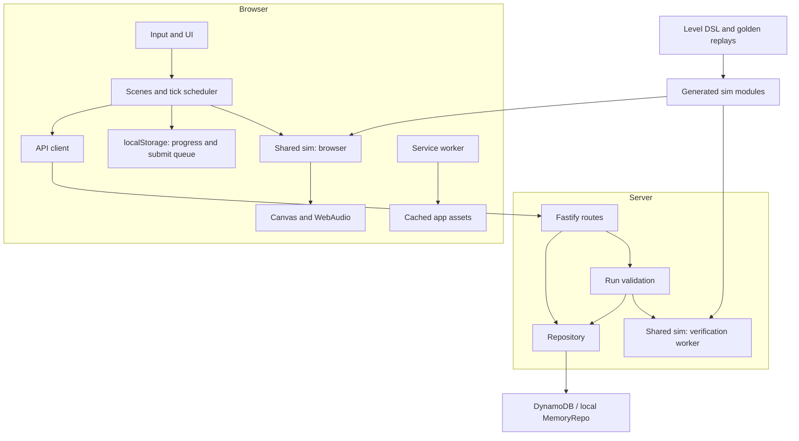
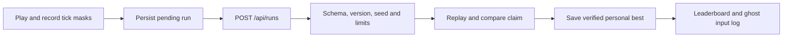
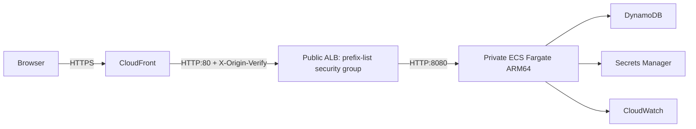

# Architecture

<a href="#english">English</a> · <a href="#korean">한국어</a>

## English

### Components

The browser owns play, rendering, synthesized audio and local progress. Fastify
serves the built client and verifies submitted input logs before updating shared
leaderboards. Both runtimes import the same simulation source.

| Boundary | Source |
|---|---|
| Browser composition and subsystem ports | [main.ts](../src/client/main.ts), [contracts.ts](../src/client/contracts.ts), [scenes.ts](../src/client/scenes.ts) |
| Fixed 120 Hz simulation and replay format | [types.ts](../src/sim/types.ts), [sim.ts](../src/sim/sim.ts), [replay.ts](../src/sim/replay.ts) |
| Protocol, routes and verification | [protocol.ts](../src/shared/protocol.ts), [app.ts](../src/server/app.ts), [runs.ts](../src/server/runs.ts), [verifyPool.ts](../src/server/verifyPool.ts) |
| Authored content and generated output | [levels/build.ts](../levels/build.ts), [solutions.ts](../levels/solutions.ts) |
| Build and offline assets | [build.mjs](../tools/build.mjs), [lib.mjs](../tools/lib.mjs), [sw.ts](../src/client/sw/sw.ts) |

[The character rig](../src/client/render/clawd.ts) draws the cat and its eight skin
palettes. `PlayerVisual` in [actors.ts](../src/client/render/actors.ts) keeps the
ear springs and scarf chain in presentation state; [particles.ts](../src/client/render/particles.ts)
reuses `drawClawdSilhouette` for dash afterimages.
`PORTRAIT_FEET` in [contracts.ts](../src/client/contracts.ts) defines the foot
position within a square portrait as `(0.5, 0.88)` of its size. `drawClawdPortrait`
and [the ending UI](../src/client/ui/ui.ts) share this anchor to align the cat's
feet with the tower summit across canvas sizes. These are browser presentation
details and do not change simulation hitboxes or replay contracts.

### A submitted run

Each tick consumes a mask byte; press edges come from consecutive masks, including
checkpoint retry. The submitted claim includes the measured result, but the server
recomputes it from the replay. Daily seeds come from a server HMAC of the UTC date;
daily submissions accept today and yesterday. Assist runs are not board-eligible,
and endless mode keeps local records.

Production verification runs in a worker with bounded admission; excess work gets
`503 busy` and `Retry-After`. DynamoDB stores replays, personal bests and leaderboard
rows. Public leaderboards can be edge-cached; personal `/api/me` responses are
`no-store`. Downloaded ghost logs drive another instance of the same simulation.

### Deployment

[The CDK stack](../infra/lib/stack.ts) imports an existing VPC. It places the ALB
in public subnets and tasks in private subnets without public IPs. CloudFront's
origin-facing prefix list restricts ingress; the ALB forwards only when the origin
header matches and otherwise returns 403. The configured service uses 512 CPU
units, 1024 MiB and an initial two tasks, with an autoscaling range of two to ten.
DNS and the existing viewer certificate are outside this stack.

The service hosts both `/api/*` and static files. Hashed assets use immutable
caching; HTML and the service worker require refresh checks. A separate
CloudFront behavior caches public leaderboard responses. The service worker
handles app assets, leaving API requests to the network.

### Constraints and further reading

The current contract is `SIM_VERSION = 4`, `GEN_VERSION = 2`. Replay-affecting
changes require coordinated version, content and corpus updates. The simulation
does not use browser or Node APIs, wall-clock time or unseeded randomness.
[The shared-simulation decision](decisions/0001-shared-replay-validation.md)
records the reason for this boundary.

Local development uses MemoryRepo; production selects DynamoDB with `TABLE_NAME`.
`npm run build` consumes checked-in generated modules rather than invoking the
level builder. CI checks those modules and the digest fixture separately.
See [implementation references](reference/INDEX.md), [onboarding](onboarding.md)
and [release operations](runbooks/release.md). Dated quality reports describe
their recorded executions, not live infrastructure state.

## 한국어

### 구성 요소

브라우저가 플레이·렌더링·합성 오디오·로컬 진행도를 담당합니다. Fastify는 빌드된
클라이언트를 제공하고, 제출된 입력 로그를 검증한 뒤 공유 리더보드를 갱신합니다.
두 런타임은 같은 시뮬레이션 소스를 가져옵니다.

| 경계 | 소스 |
|---|---|
| 브라우저 구성과 서브시스템 포트 | [main.ts](../src/client/main.ts), [contracts.ts](../src/client/contracts.ts), [scenes.ts](../src/client/scenes.ts) |
| 고정 120 Hz 시뮬레이션과 리플레이 형식 | [types.ts](../src/sim/types.ts), [sim.ts](../src/sim/sim.ts), [replay.ts](../src/sim/replay.ts) |
| 프로토콜·라우트·검증 | [protocol.ts](../src/shared/protocol.ts), [app.ts](../src/server/app.ts), [runs.ts](../src/server/runs.ts), [verifyPool.ts](../src/server/verifyPool.ts) |
| 저작 콘텐츠와 생성 산출물 | [levels/build.ts](../levels/build.ts), [solutions.ts](../levels/solutions.ts) |
| 빌드와 오프라인 에셋 | [build.mjs](../tools/build.mjs), [lib.mjs](../tools/lib.mjs), [sw.ts](../src/client/sw/sw.ts) |

[캐릭터 리그](../src/client/render/clawd.ts)는 고양이와 여덟 스킨 팔레트를 그립니다.
[actors.ts](../src/client/render/actors.ts)의 `PlayerVisual`은 귀 스프링과 스카프
체인을 표현 상태로 보관하고, [particles.ts](../src/client/render/particles.ts)는
`drawClawdSilhouette`을 대시 잔상에 재사용합니다.
[contracts.ts](../src/client/contracts.ts)의 `PORTRAIT_FEET`는 정사각형 초상 안의
발 위치를 크기 대비 `(0.5, 0.88)`로 정의합니다. `drawClawdPortrait`와
[엔딩 UI](../src/client/ui/ui.ts)가 이 기준점을 공유해 캔버스 크기가 달라져도
고양이의 발을 탑 정상에 맞춥니다. 이 값과 동작은 브라우저의 표현을 담당하며
시뮬레이션 히트박스나 리플레이 계약을 바꾸지 않습니다.

### 기록 제출 흐름

틱마다 마스크 1바이트를 소비하고 연속된 마스크에서 누름 엣지를 계산합니다.
체크포인트 재도전도 마스크에 포함됩니다. 제출에는 측정 결과인 주장도 들어가지만,
서버는 리플레이로 결과를 다시 계산합니다. 데일리 시드는 UTC 날짜에 대한 서버
HMAC으로 만들며 오늘·어제 기록을 접수합니다. 보조 모드 기록은 보드 부적격이고,
끝없는 등반은 로컬 기록을 사용합니다.

운영 검증은 접수량이 제한된 워커에서 실행하며 초과 요청에는 `503 busy`와
`Retry-After`를 반환합니다. DynamoDB는 리플레이·개인 최고·리더보드 행을 저장합니다.
공개 보드는 엣지 캐시를 사용할 수 있고 개인 `/api/me` 응답은 `no-store`입니다.
다운로드한 고스트 로그는 같은 시뮬레이션의 별도 인스턴스를 구동합니다.

### 배포

[CDK 스택](../infra/lib/stack.ts)은 기존 VPC를 가져옵니다. ALB는 퍼블릭 서브넷에,
태스크는 퍼블릭 IP 없이 프라이빗 서브넷에 배치합니다. CloudFront 원본 접근용
prefix list로 인그레스를 제한하고 ALB는 원본 헤더가 일치할 때만 전달하며,
나머지 요청에는 403을 반환합니다. 설정된 서비스는 CPU 512 유닛·1024 MiB·
초기 태스크 두 개를 사용하며 자동 확장 범위는 2~10개입니다.
DNS와 기존 뷰어 인증서는 스택 밖에서 관리합니다.

서비스 하나가 `/api/*`와 정적 파일을 제공합니다. 해시 에셋은 immutable 캐시를
사용하고 HTML·서비스 워커는 갱신 확인이 필요합니다. 공개 리더보드는 별도의
CloudFront 동작으로 캐시합니다. 서비스 워커는 앱 에셋을 처리하며 API 요청은
네트워크에 맡깁니다.

### 제약과 관련 문서

현재 계약은 `SIM_VERSION = 4`, `GEN_VERSION = 2`입니다. 리플레이 결과가 바뀌면
버전·콘텐츠·코퍼스를 함께 갱신해야 합니다. 시뮬레이션은 브라우저·Node API,
실제 시각, 시드 없는 난수를 사용하지 않습니다.
[공유 시뮬레이션 결정](decisions/0001-shared-replay-validation.md)에 이 경계의
이유를 기록했습니다.

로컬 개발은 MemoryRepo를 사용하고 운영은 `TABLE_NAME`으로 DynamoDB를 선택합니다.
`npm run build`는 레벨 빌더를 호출하지 않고 커밋된 생성 모듈을 사용합니다.
CI가 이 모듈과 다이제스트 픽스처를 별도로 검사합니다.
[구현 참조](reference/INDEX.md), [온보딩](onboarding.md),
[릴리스 운영](runbooks/release.md)을 참고하세요. 날짜가 있는 품질 보고서는
당시 실행 결과이며 실시간 인프라 상태를 뜻하지 않습니다.
