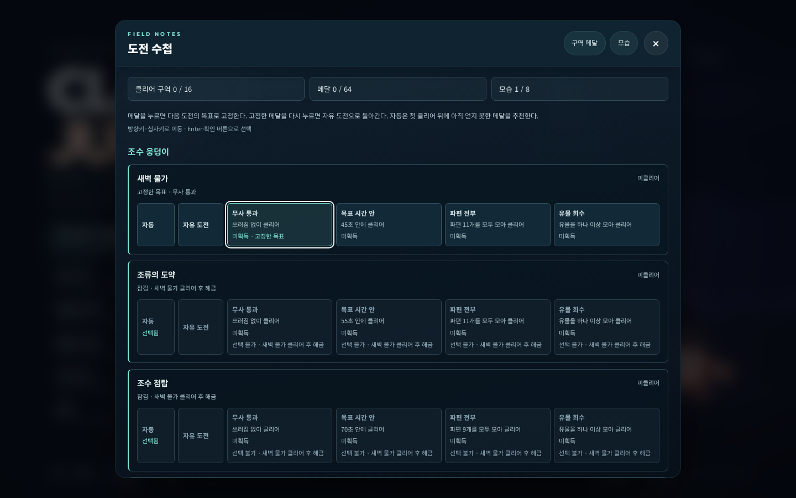
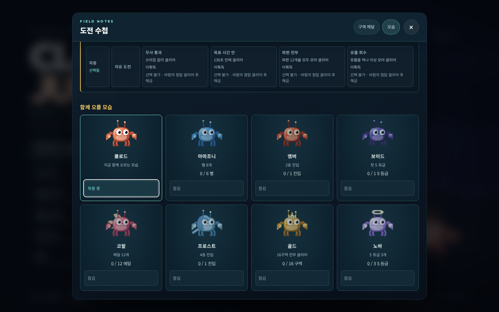
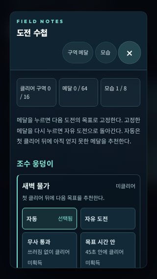
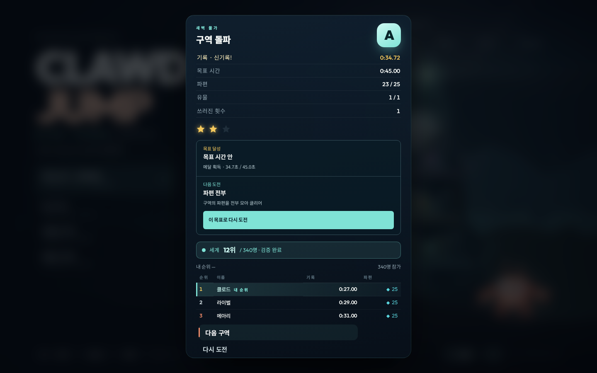

# ECHO TOWER — 도전 목표와 보상 동선

[화면·안정성 개선](2026-09-13-premium-report.md)에 이어, 이미 게임에 있던 메달과 모습을 다시 오를 이유로 연결했다. 이번 단계의 애플리케이션 빌드는 **`bd8f1cb4`**이며 변경분은 **Unreleased**다.

## 달라진 플레이 흐름

| 위치 | 반영한 동작 |
|---|---|
| 도전 수첩 | 16구역의 메달 조건·획득 상태, 잠긴 구역의 해금 조건, 여덟 가지 모습의 해금 진행·착용 |
| 구역 선택·일시정지 | 자동 추천·자유 등반·특정 메달을 선택하고 구역별로 저장 |
| 플레이 HUD | 실제 시간·쓰러짐·수집품으로 목표 상태 표시. 수집 완료와 클리어 후 달성을 구분 |
| 결과 | 이번 목표의 결과와 아직 얻지 못한 다음 메달. 버튼 하나로 해당 목표를 고정하고 처음부터 재도전 |
| 화면 사이 이동 | 수첩을 닫으면 원래 화면과 초점으로 복귀. 진행 중인 도전·시뮬레이션·입력 로그·시간 보존 |

자동 추천은 첫 클리어 뒤에 시작한다. 유물 → 파편 → 목표 시간 → 무사 통과 순으로 남은 메달을 고르며, 해당 수집품이 없거나 이미 모두 획득한 구역에는 불가능한 목표를 제시하지 않는다. 플레이어가 직접 고른 목표는 별도로 유지한다.

목표 선택은 진행도를 올리지 않는다. 보조 모드의 기존 로컬 메달 획득은 유지하며 공개 순위 등록 조건과 구분한다. 잠긴 구역의 기록 없는 경주는 연습 결과로 표시한다. 체크포인트 재도전은 누적 쓰러짐과 시간을 유지하고, 구역 처음부터 재시작할 때 새 시도가 시작된다.

리뷰에서는 이미 획득한 메달을 고정한 뒤 실패하면 같은 메달을 다음 추천으로 내놓는 경우를 발견했다. 실제 시뮬레이션으로 재현했고, 미획득 메달만 추천하거나 모두 얻었으면 추천을 숨기도록 수정했다. 선택한 목표는 바꾸지 않는다.

## 검증

| 검사 | 결과 |
|---|---|
| 앱·인프라 TypeScript | 통과 |
| 전체 단위·통합·실제 브라우저 오디오 시험 | **1,727 / 1,727**, 90개 파일 |
| Chromium 사용자 흐름 | **39 / 39**, 문제 0 |
| WebKit 사용자 흐름 | **39 / 39**, 문제 0 |
| 기존 모바일 회귀 | **54 / 54**, 문제 0 |
| 메뉴·플레이·오프라인 스모크 (`--no-shots`) | **6 / 6**, 문제 0 |
| 장애물·배경·비콘 판독성 | **10 / 10**, 문제 0 |
| 레벨 격자 | 통과 |
| 레벨·코퍼스 생성 파일 | 최신, SIM 4 · GEN 2 |
| Chromium / WebKit / Firefox 결정론 | 각각 **18 / 18**, Node 기준과 일치 |
| ARM64 컨테이너 | healthy, 비루트 `node`, **175,798,471 B** |

새 사용자 흐름은 1440×900, 750×340, 390×844에서 실제 클릭·터치·키 입력으로 검증했다. 목표를 고른 뒤 페이지를 다시 열어 저장과 선택 상태를 확인했다. 일시정지 중 수첩에서 자유 등반과 메달 목표를 바꾸어도 같은 Run·Sim·MaskLog와 모든 입력 바이트, 틱, 경과 시간이 유지됐다. 체크포인트 재도전의 `IN.RETRY`는 정확히 한 번 기록됐으며 무사 통과 목표는 실패로 남았다. 처음부터 재시작하면 새 Run과 입력 로그에서 목표가 다시 활성화됐다.

추가로 320×568에서 수첩의 가로 넘침이 없고 모든 수첩 버튼이 44×44 CSS px 이상임을 확인했다. 결과 화면은 샘플 데이터로 1440×900, 750×340, 320×568 배치를 별도로 살폈다. 이는 실제 클리어 기록이 아니라 시각 검사용 화면이다. 클리어·메달 부여·목표 재도전의 의미는 실제 Sim을 사용하는 셸 회귀 시험으로 검증한다.

기존 모바일 검사는 크레딧의 예전 메뉴 위치를 찾고 있었다. 타이틀 전체에서 현재 버튼을 찾도록 수정하고 도전 수첩·설정·크레딧의 화면 내 배치를 함께 검사했다. 검사 단계별 진행도도 출력한다.

## 근거와 범위

운영 로그는 2026-09-08 00:00부터 2026-09-13 04:23:22 UTC까지 읽기 전용으로 집계했다. SIM 4에서 부팅 7세션, t1 시작 1회, 클리어 0회가 관측됐다. 사람의 수·완주율·재방문 효과를 판단할 표본으로는 부족하다. 기존 초보 봇의 정책은 가로 이동 중심이어서 세로 구역의 0회 클리어를 사람에게 불가능한 난이도로 해석하지 않았다. 이번에는 물리나 지형을 변경하지 않고 코드에서 확인된 목표·보상 안내의 빈틈을 개선했다.

검증은 Linux 브라우저와 기기 에뮬레이션에서 수행했다. WebKit·Firefox는 공식 Playwright 컨테이너에서 실행했고, 공개 QA 파일만 읽기 전용으로 연결했다. 격리 네트워크에서 선택적 웹폰트 연결 실패는 경고였으며 한글 대체 글꼴과 화면 배치를 확인했다. 실물 휴대폰·컨트롤러의 장시간 플레이나 이용자 반응을 측정한 결과는 아니다.

수치와 운영 집계는 [검증 데이터](2026-09-13-mastery-evidence.json)에 있다. 이전 단계 대비 JS는 543,431 B에서 560,343 B, gzip은 166,306 B에서 171,916 B로 증가했다. 이번 추가분의 gzip 전송량은 약 5.5 KiB다. 이전 보고서의 그리기 시간은 그 빌드에서 측정한 값이며 이번 빌드의 새 성능 측정으로 사용하지 않는다.

## 화면









## 재현

```bash
npm run typecheck
npm run levels -- --check
npx tsx tools/hash-corpus.ts --check
CLAWD_BROWSER_TESTS=1 npm test
NODE_ENV=production npm run build
```

빌드된 서버를 실행한 뒤 `BASE_URL`로 검증 대상을 지정한다.

```bash
npm run qa:premium
npm run qa:webkit
npm run qa:mobile
npm run qa:smoke -- --no-shots
npm run qa:readability
npm run qa:grid
npx tsx tools/qa/selftest.ts --require=chromium,webkit,firefox
```
