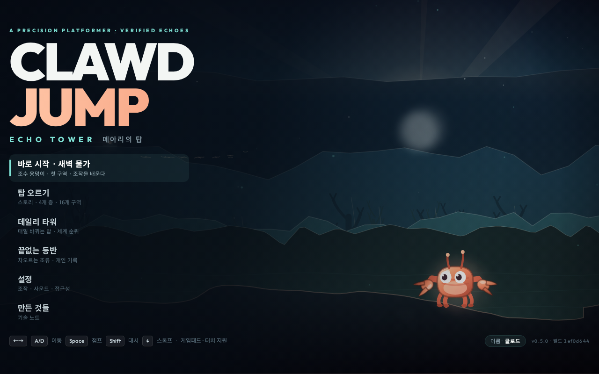
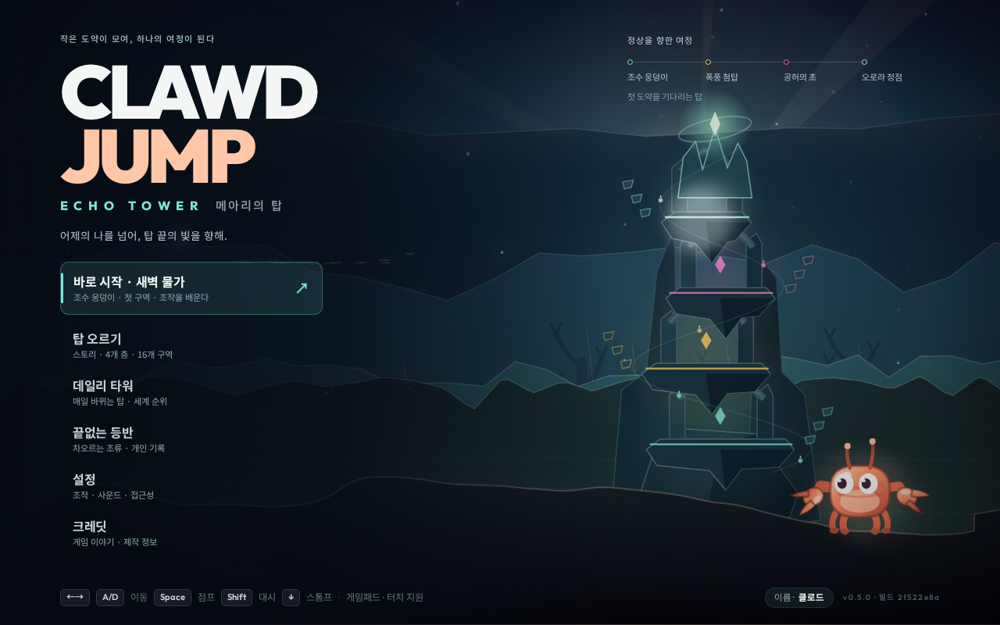
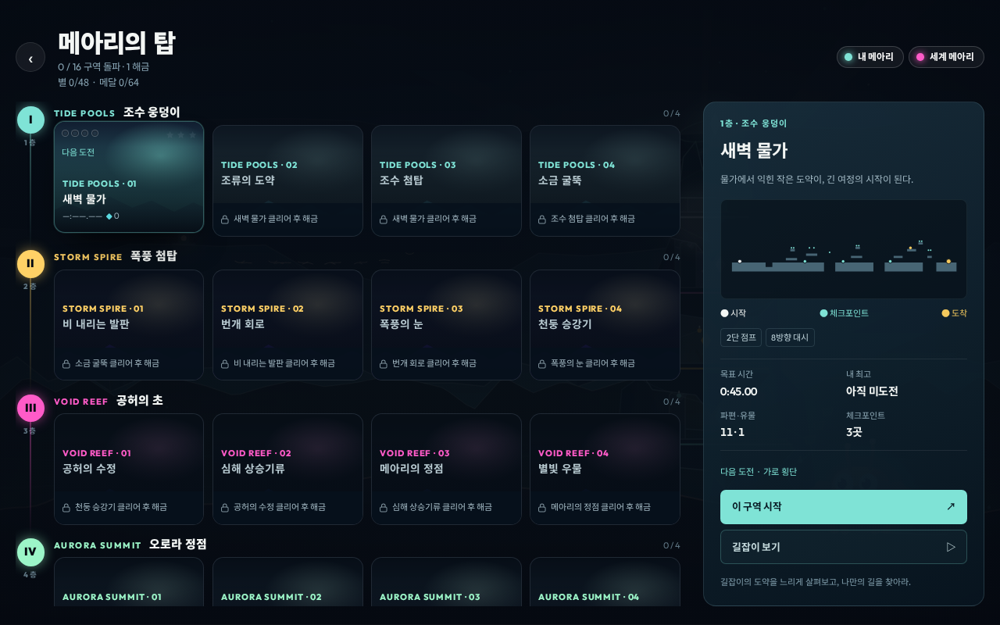
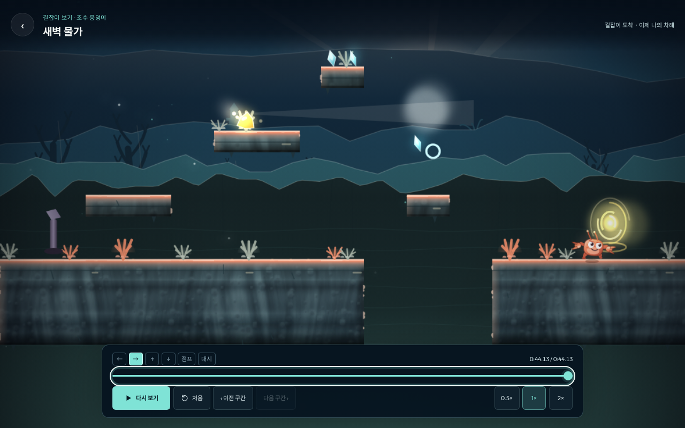

# ECHO TOWER — 품질 개선과 검증 기록

기준은 `ab2d975`의 v0.5.0이다. 기존 게임은 16개 구역, 네 바이옴, 데일리·끝없는 등반, 서버 리플레이 검증과 오프라인 플레이를 갖추고 있었다. 이번 작업은 첫인상, 구역 선택, 공략 학습과 실패 복귀, 저장·입력·오디오의 신뢰성을 개선했다. 변경은 **Unreleased**이며, 배포 이력과 구분한다.

이 문서의 수치와 화면은 첫 단계 빌드 `2f522e8a`의 기록이다. 이후 도전 수첩·목표·보상 동선과 최종 검증은 [후속 보고서](2026-09-13-mastery-report.md)에 기록한다.

## 플레이어에게 달라진 점

| 영역 | 기준 상태에서 확인한 문제 | 반영한 동작 |
|---|---|---|
| 첫 화면 | 게임 제목의 ‘탑’이 배경에 드러나지 않음 | 네 층의 절차적 탑, 정상 비콘, 메아리 궤적과 층별 진행 |
| 구역 선택 | 잠금이 이름을 가리고 조건을 설명하지 않음 | 읽을 수 있는 구역 이름·해금 조건, 다음 도전 표시 |
| 도전 준비 | 구역을 시작하기 전에는 지형과 기술을 살펴보기 어려움 | 실제 레벨 데이터로 그린 지도, 목표 시간·수집품·체크포인트·기록 |
| 학습 | 번들된 공략을 플레이어가 직접 재생할 수 없음 | 16구역 길잡이, 0.5×/1×/2×, 위치·체크포인트 이동, 입력 표시 |
| 실패 복귀 | 터치에서는 체크포인트 재도전 동작이 없음 | 일시정지에서 즉시 요청, 기존 `IN.RETRY`를 기록해 서버에서 재현 |
| 관람 후 복귀 | 새 화면이 원래 도전이나 안내를 지우면 학습 흐름이 끊김 | 도전·Sim·입력 로그·카메라를 보존하고 힌트·스플릿 복원 |
| 비동기 갱신 | 순위 응답이 선택한 구역을 다른 구역으로 바꿀 수 있음 | 선택·관람 중에도 같은 구역과 돌아갈 초점을 유지 |

새 타이틀은 래스터 에셋 없이 그린다. 지형 미리보기는 실제 타일과 시작·체크포인트·골의 위치를 사용하며, 임의의 경로를 그리지 않는다. 길잡이는 별도 `Sim`에서 검증된 입력을 재생한다. 관람은 진행도나 순위표에 기록되지 않는다.

## 안정성

- **저장:** 오래 열린 탭의 종료가 새 진행도를 덮어쓰는 문제를 수정했다. 이전 상태·현재 편집·최신 저장을 비교해 병합하며, 최고 기록과 리플레이는 한 묶음으로 유지한다. 초기화·가져오기는 별도 경계로 처리한다. 다른 탭의 설정을 반영하면 오디오와 화면 설정도 다시 적용한다.
- **전송:** POST 전에 요청을 보관하고 확정 응답 뒤에 제거한다. 전송 중인 항목은 대기열의 중복 전송을 피한다. 응답 본문까지 시간 제한을 적용하며 불완전한 성공 응답은 복구할 수 있도록 유지한다.
- **진행도 이전:** 읽기 실패로 코드가 먼저 소모되지 않도록, 일관된 읽기 후 조건부 트랜잭션으로 코드와 스냅샷을 함께 소비한다.
- **오디오:** 음악·효과음의 잔향도 해당 채널 음량을 따른다. 실제 WebAudio 렌더링에서 음량 0%의 출력이 정확히 0인지 확인한다.
- **조작:** 재지정 취소·설정 닫기·탭 전환·창 전환을 처리한다. 가려진 화면은 초점을 받지 않으며, 모달 안에서 Tab으로 이동하고 돌아갈 초점을 복원한다. Escape와 재생 일시정지의 중복 바인딩도 처리한다.
- **배포 산출물:** 개발용 `.agents`·`.codex`가 컨테이너에 들어가지 않도록 Docker와 CDK의 제외 규칙을 함께 갱신했다.

## 성능과 크기

원본을 별도 디렉터리에 다시 빌드해 같은 조건으로 비교했다. Chromium 153, ARM64 Linux, 1280×800 @1, 고화질에서 장면별 180개 표본을 수집했다.

| 측정 | 원본 | 개선 후 |
|---|---:|---:|
| 클라이언트 JS | 515,065 B | 543,431 B |
| JS gzip | 156,512 B | 166,306 B |
| 타이틀 그리기 CPU p95 | 2.2 ms | 2.3 ms |
| 플레이 그리기 CPU p95 | 3.4 ms | 3.4 ms |

JS 전송량 증가는 gzip 기준 약 9.6 KiB다. 시간은 렌더러의 JavaScript 그리기 호출을 측정한 값이며 GPU·화면 표시 지연이나 휴대폰 FPS를 뜻하지 않는다. 원시 수치는 [evidence.json](2026-09-13-evidence.json)에 있다.

동작 줄이기는 자동 화질 변화와 PNG 인코딩 차이를 분리해 검증했다. 고정 고화질에서 700 ms 간격의 원시 캔버스 픽셀 변화는 0, 배경 시계·카메라·캐릭터 애니메이션 시간도 0이었다. 같은 설정에서 실제 오른쪽 키 입력은 36틱 동안 약 23.8유닛 이동했다.

## 검증 결과

최종 애플리케이션 빌드는 **`2f522e8a`**다. 원본은 1,476개 테스트가 통과했고, 추가·보완 후에는 실제 브라우저 오디오 시험을 포함해 **86개 파일의 1,601개 테스트가 모두 통과**했다.

| 검사 | 결과 |
|---|---|
| 앱·인프라 TypeScript 검사 | 통과 |
| 생성된 레벨·코퍼스 최신성 | 통과, SIM 4 · GEN 2 |
| 전체 단위·통합·오디오 시험 | 1,601 / 1,601 |
| Chromium 실제 사용자 흐름 | 27 / 27, 문제 0 |
| WebKit 실제 사용자 흐름 | 27 / 27, 문제 0 |
| 기존 플레이·오프라인 스모크 | 23 / 23 |
| 기존 모바일 검사 | 54 / 54 |
| 장애물·배경·비콘 판독성 | 10 / 10 |
| 레벨 격자 오버레이 | 통과 |
| Chromium / WebKit / Firefox 결정론 | 각각 18 / 18, 합계 54개 일치 |
| ARM64 배포 이미지 | 빌드 성공, 비루트 `node`, 175,713,642 B, 헬스체크 healthy |

새 사용자 흐름은 데스크톱 1440×900, 휴대폰 가로 750×340, 세로 390×844에서 검사했다. 실제 클릭·터치·키 입력으로 구역 선택, 재생·정지·배속·위치 이동, 체크포인트 이동, 원래 도전 복원, 재도전 기록과 모달 Tab 이동을 확인했다. 게임 상태를 테스트 코드로 이동시키는 방식은 사용하지 않았다.

검사 중 발견한 숨은 상태 오류도 회귀 시험에 포함했다. 순위 응답이 관람 중에 도착해도 원래 구역을 유지하며, Escape는 재생을 토글하는 대신 관람을 닫는다. 다른 탭의 음소거를 병합한 뒤 실제 오디오가 이전 음량으로 남는 문제도 재현 후 수정했다.

## 화면

| 이전 타이틀 | 개선한 타이틀 |
|---|---|
|  |  |





## 재현

```bash
npm run typecheck
npm run levels -- --check
npx tsx tools/hash-corpus.ts --check
CLAWD_BROWSER_TESTS=1 npm test
NODE_ENV=production npm run build
```

빌드된 서버를 실행한 뒤 다음을 실행한다. `BASE_URL`로 검증 대상을 지정할 수 있다.

```bash
npm run qa:smoke
npm run qa:mobile
npm run qa:premium
npm run qa:webkit
npm run qa:audio
npm run qa:readability
npm run qa:grid
npx tsx tools/qa/selftest.ts --require=chromium,webkit,firefox
```

Ubuntu에서는 `npx playwright install --with-deps chromium webkit firefox`로 준비한다. 이번 ARM64 Amazon Linux 환경의 WebKit·Firefox는 공식 `mcr.microsoft.com/playwright:v1.63.0-noble` 컨테이너에서 실행했다. 외부 테스트 이미지에는 컴파일된 QA 스크립트, 공개 Playwright 패키지, 공개 다이제스트만 담은 읽기 전용 폴더를 연결했다. 스크린샷은 별도 출력 폴더에 쓰고, 게임 컨테이너와의 내부 네트워크만 사용했다.

격리 환경의 선택적 웹폰트 연결 실패는 경고로 구분한다. 동일 출처 오류, 실행 예외, 버전 불일치와 다이제스트 불일치는 실패다. 가상 기기는 서로 다른 테스트용 엣지 주소로 실제 서버의 요청 제한을 적용받는다.

## 검증 범위와 다음 단계

물리, 레벨 지형, `SIM_VERSION 4`, `GEN_VERSION 2`는 기존 기록과 호환된다. 이번 단계는 코드·화면·입력·리플레이·저장 신뢰성의 개선이다.

- Linux의 브라우저 및 기기 에뮬레이션을 사용했다. 실물 컨트롤러, iOS·Android의 진동·배터리·장시간 플레이·설치는 별도 실측 대상이다.
- 탭 간 저장 병합은 브라우저 프로세스 사이의 원자적 잠금을 제공하지 않는다. 전송이 성공한 뒤 응답만 잃은 이전 코드는 다시 사용할 수 없다.
- 전체 상용 품질 목표의 다음 단계는 실제 플레이를 바탕으로 한 난이도·학습 곡선·반복 플레이의 평가다. 자동 검증 결과를 플레이어 평가나 시장 성과로 해석하지 않는다.
